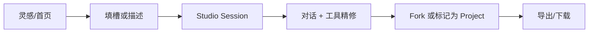

# Project 交付工作流

> 确立 **Project** 为 AIMarket 的可交付锚点：Session 是过程，Project 是结果。

---

## 1. 概念

| 实体 | 含义 | `kind` |
|------|------|--------|
| **Canvas 会话** | 单轮/探索式创作 | `canvas` |
| **Project 项目** | 可交付、可归档、可导出 | `project` |

Project 与 Canvas 共用同一套消息、Job、画布布局；差异在于产品语义与 UI 引导。

---

## 2. 用户路径：Session → Project → Export

### 2.1 创建 Project 的入口

1. **项目库** → 「新建项目」→ `/studio?kind=project`
2. **灵感做同款** → 「Fork 为项目」→ `POST /api/v1/inspiration/:id/fork-project`
3. **电商套图** → `mode=ecommerce` + `kind=project`（ScenarioQuickBar 深链）

### 2.2 Session 内创作

- 左侧 **画布**：生成结果主视图，Job 渐进落位
- 右侧 **对话区**：自然语言 + Agent 计划 + 工具 Dock
- 多轮消息与 Job 均绑定同一 `sessionId`

### 2.3 交付 Export

| 方式 | API / UI |
|------|----------|
| 单张下载 | 画布选中 → 下载 |
| 全部导出 | 未选中时 → `GET /imageSession/:id/export` → 逐张打开 URL |
| 项目库 | `/projects` 筛选 `kind=project` → 继续编辑 |

---

## 3. 灵感模板关联

Fork 自灵感时，会话写入：

- `source_inspiration_id` — 模板 ID
- `template_variables_json` — 用户填写的槽位值

便于后续「同款复用」与团队模板库扩展。

---

## 4. 与 Agent / 套图的关系

- **电商套图 Agent**：`productSet/generate` 或 `agent/execute`（ecommerce 意图）→ 4 张 slide Job
- **Agent Planner**：`POST /agent/plan` 预览步骤 → `POST /agent/execute` 执行（高积分需 confirm）
- Project 内套图 Job 支持 **渐进式出图**（见 [CANVAS_FEEDBACK.md](./CANVAS_FEEDBACK.md)）

---

## 5. 成功标准（产品）

| 用户 | 路径 | 目标 |
|------|------|------|
| 电商运营 | 灵感 Fork → 套图 → 微调 → 导出 | 30 分钟内可上架素材 |
| 设计师 | Studio Project → 工具链 → 导出 | 步骤可复现、可审计 |
