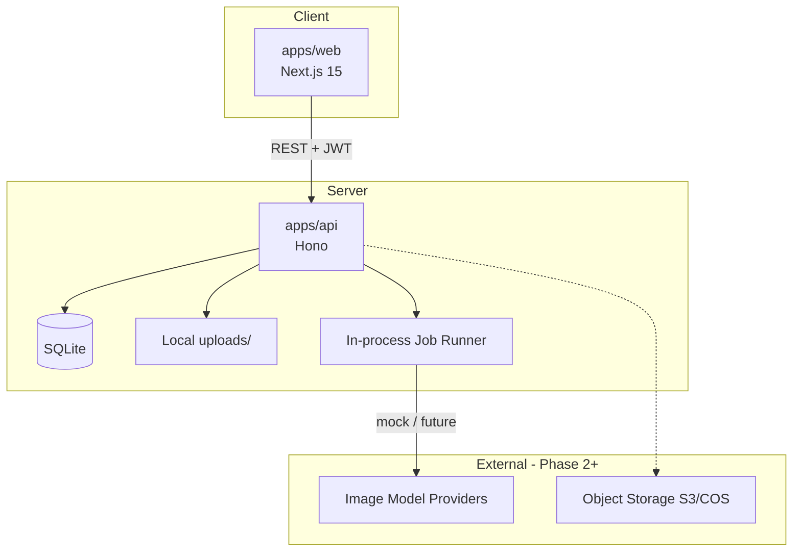
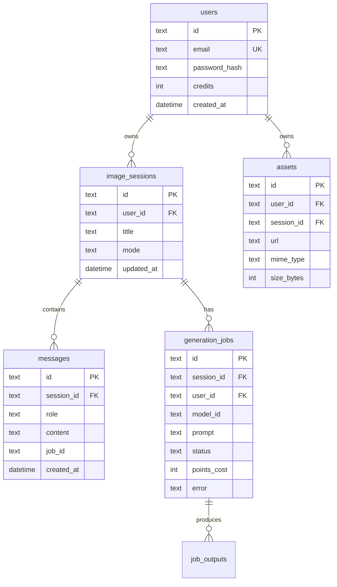
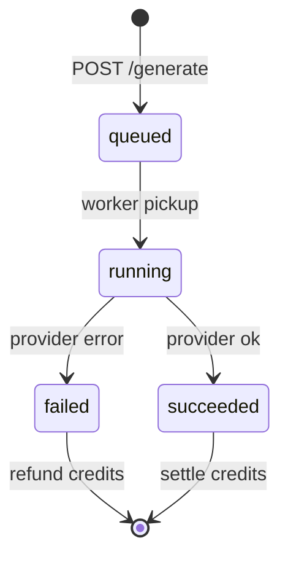

# AIMarket 技术规格书

| 项目 | 内容 |
|------|------|
| 版本 | v1.0 |
| 更新 | 2026-05-24 |
| 架构阶段 | Phase 4 |

---

## 1. 系统架构



### 1.1 Monorepo 结构

```
aimarket/
├── apps/web/           # Next.js 前端
├── apps/api/           # Hono 后端
├── packages/ui/        # 共享 React 组件
└── docs/               # PRD / 产品 / 技术文档
```

### 1.2 技术选型

| 层 | 选型 | 理由 |
|----|------|------|
| 前端框架 | Next.js 15 App Router | SSR/路由/生态 |
| 样式 | Tailwind CSS v4 | 快速实现深色玻璃风 |
| 组件 | `@aimarket/ui` + Radix 可选 | 跨应用复用 |
| API | Hono + @hono/node-server | 轻量、TypeScript 友好 |
| 数据库 | better-sqlite3 | Phase 1 零运维 |
| 认证 | JWT (jose) + bcrypt | 无状态、易扩展 |
| 任务 | 内存队列 + setTimeout | Phase 1；Phase 2 换 BullMQ/Redis |

---

## 2. 数据模型

### 2.1 ER 图



### 2.2 枚举

```typescript
type CreationMode = "chat" | "quick" | "ecommerce";
type JobStatus = "queued" | "running" | "succeeded" | "failed";
type MessageRole = "user" | "assistant" | "system";
```

---

## 3. API 规格（Phase 1）

**Base URL**：`http://localhost:4000`  
**认证**：`Authorization: Bearer <jwt>`（除 auth/health 外）

### 3.1 认证

#### `POST /api/v1/auth/register`

```json
// Request
{ "email": "user@example.com", "password": "至少8位" }

// Response 201
{
  "data": {
    "token": "eyJ...",
    "user": { "id": "uuid", "email": "...", "credits": 100 }
  }
}
```

#### `POST /api/v1/auth/login`

同 register 响应结构。

### 3.2 用户

#### `GET /api/v1/user/getInfo`

```json
{ "data": { "id", "email", "credits", "createdAt" } }
```

#### `GET /api/v1/user/queryPoints`

```json
{ "data": { "credits": 100 } }
```

### 3.3 会话

#### `POST /api/v1/imageSession/create`

```json
{ "mode": "chat", "title": "可选" }
// → { "data": { "id", "mode", "title", "createdAt" } }
```

#### `GET /api/v1/imageSession/list`

Query: `limit=20` → 当前用户最近会话。

#### `GET /api/v1/imageSession/:id/messages`

返回消息列表（含 `attachments`, `outputs`）。

#### `GET /api/v1/imageSession/queryImageSessionRequestMode`

Query: `sessionId` → `{ mode, status }`（兼容椒图路径）。

### 3.4 资产

#### `POST /api/v1/assets/upload`

`multipart/form-data`: `file`, optional `sessionId`

```json
{ "data": { "id", "url", "mimeType", "sizeBytes" } }
```

静态访问：`GET /uploads/:filename`

### 3.5 生成

#### `POST /api/v1/ai/estimatePointsBatch`

```json
{ "items": [{ "modelId": "omni-v2", "count": 1, "resolution": "1k" }] }
// → { "data": { "totalPoints": 10 } }
```

#### `POST /api/v1/ai/generate`

```json
{
  "sessionId": "uuid",
  "prompt": "让背景变成高级灰",
  "modelId": "omni-v2",
  "count": 1,
  "resolution": "1k",
  "mode": "chat",
  "assetIds": ["uuid"]
}
// → { "data": { "jobId": "uuid", "estimatedPoints": 10 } }
```

#### `GET /api/v1/ai/jobs/:id`

```json
{
  "data": {
    "id", "status", "outputs": [{ "url" }],
    "pointsCost", "error"
  }
}
```

#### `GET /api/v1/ai/queryModels`

模型元数据列表（id, name, description, type, pointsFactor）。

### 3.6 错误格式

```json
{
  "error": {
    "code": "INSUFFICIENT_CREDITS",
    "message": "积分不足"
  }
}
```

| HTTP | code | 说明 |
|------|------|------|
| 400 | VALIDATION_ERROR | 参数错误 |
| 401 | UNAUTHORIZED | 未登录 |
| 402 | INSUFFICIENT_CREDITS | 积分不足 |
| 404 | NOT_FOUND | 资源不存在 |
| 429 | RATE_LIMITED | 请求过频 |

---

## 4. 生成任务状态机



**Mock Provider（Phase 1）**：

- 延迟 2–4s 模拟推理  
- 输出：基于 prompt hash 的 placeholder 图（picsum.photos 或本地 SVG）  
- 接口：`ImageProvider.generate(params): Promise<string[]>`

---

## 5. 前端架构

### 5.1 目录（apps/web）

```
src/
├── app/                 # 路由
├── components/          # 页面组件
├── lib/
│   ├── api-client.ts    # 带 token 的 fetch 封装
│   ├── auth-store.ts    # 登录态（localStorage + context）
│   └── types.ts         # 与 API 对齐的类型
└── hooks/
    ├── use-session.ts
    └── use-generation.ts
```

### 5.2 状态管理

| 状态 | 方案 |
|------|------|
| 登录 Token | `localStorage` + React Context |
| 会话消息 | 服务端为源；`useEffect` + 轮询 job |
| UI 模式 Tab | 组件 local state |

### 5.3 轮询策略

- 提交生成后每 1.5s `GET /jobs/:id`，直到 `succeeded` | `failed`  
- 成功后刷新 messages 列表  

---

## 6. 安全

| 项 | 措施 |
|----|------|
| 密码 | bcrypt cost 10 |
| JWT | HS256，`JWT_SECRET` 环境变量，7d 过期 |
| 上传 | 白名单 mime；最大 10MB；随机文件名 |
| CORS | 仅允许 `CORS_ORIGIN` |
| SQL | 参数化查询（better-sqlite3 prepared） |

---

## 7. 环境变量

```bash
# apps/api
PORT=4000
CORS_ORIGIN=http://localhost:3000
JWT_SECRET=change-me-in-production
DATABASE_PATH=./data/aimarket.db
UPLOAD_DIR=./uploads
MOCK_GENERATION_DELAY_MS=2500

# apps/web
NEXT_PUBLIC_API_URL=http://localhost:4000
```

---

## 8. 部署（Phase 1 建议）

| 组件 | 方案 |
|------|------|
| Web | Vercel / Docker |
| API | 单容器 Docker + volume 挂载 SQLite & uploads |
| 数据库 | Phase 2 迁移 PostgreSQL |
| 文件 | Phase 2 迁移 S3/COS |

---

## 9. Phase 2 技术增量

- `packages/providers`：Flux / Seedream / 国内 API 适配器  
- Redis + BullMQ 任务队列  
- 模型路由服务（意图分类 → route table）  
- SSE 替代轮询推送进度  

---

## 10. 测试策略（Phase 1）

| 类型 | 范围 |
|------|------|
| API 单元 | 积分计算、状态机、鉴权中间件 |
| API 集成 | register → upload → generate → poll |
| E2E（可选） | Playwright 登录 + 一次生成 |

---

## 11. 文档索引

- [PRD.md](./PRD.md) — 需求条目与优先级  
- [PRODUCT.md](./PRODUCT.md) — 体验与运营规则  
