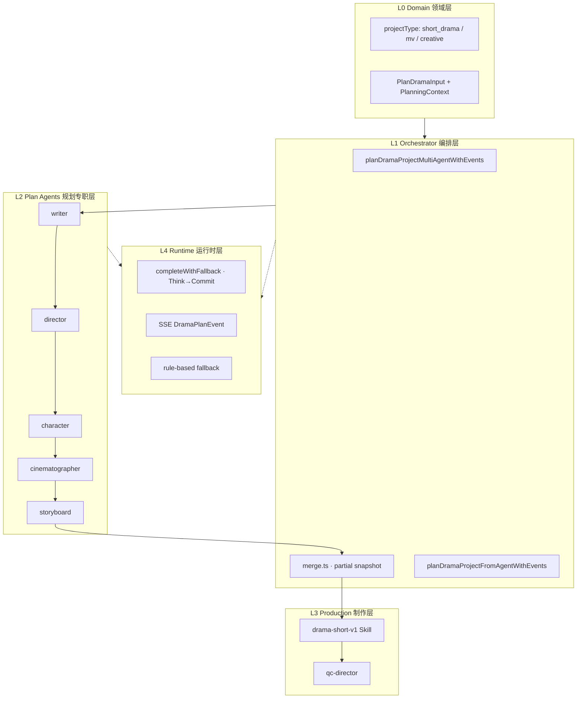

# AI 短剧 Agent 分层 Manifest

> 状态：**v1.0 文档闭环** · 2026-07-06  
> 实现：`apps/api/src/lib/drama/planner/`（prompt 暂内联于 TS，本目录为**设计真源 + 代码映射**）  
> 关联：[AGENT_ORCHESTRATION.md](../../spec/AGENT_ORCHESTRATION.md) · [DRAMA_PROD.md](../../DRAMA_PROD.md) · Phase 7 计划 `.cursor/plans/drama-multi-agent-plan-phase7.plan.md`

---

## 1. 为什么需要分层 Manifest

短剧规划原先将 **角色定义、系统提示词、JSON Schema、编排顺序** 散落在 `planner/agents/*.ts` 与 `schemas.ts` 中，存在：

| 缺口 | 影响 |
|------|------|
| 无统一 Agent 注册表 | 运营/产品无法审阅「五专职 Agent + QC」职责边界 |
| prompt 与编排耦合 | 改导演 persona 需读 TS，难以做 A/B 或热更新 |
| 与制作 Skill 割裂 | 规划 Agent 与 `drama-short-v1` 流水线缺少一张架构图 |
| 缺 handoff 契约文档 | 下游 Agent 对 id 稳定性、只增不改规则靠代码注释 |

本目录采用业界常见的 **Manifest 分层**（参考 Cursor `AGENTS.md`、CrewAI Role/Goal/Backstory、LangGraph State Graph、Structured Outputs 契约），将「设计意图」与「运行时实现」解耦，并为后续 **YAML 加载 / 热更新** 预留路径。

---

## 2. 四层架构



| 层 | 职责 | 文档 |
|----|------|------|
| **L0 Domain** | 用户梗概、时长、画幅、项目类型、多轮 refine | [variants/README.md](./variants/README.md) |
| **L1 Orchestrator** | 链式调度、上下文累积、增量快照、从某 Agent 重跑 | [orchestrator.md](./orchestrator.md) |
| **L2 Plan Agents** | 五专职 Agent：编剧→导演→角色→摄影→分镜 | [agents/](./agents/) |
| **L3 Production** | 规划完成后的 QC 与 Skill 流水线 | [agents/qc-director.md](./agents/qc-director.md) · `packages/agent-skills/skills/drama-short-v1.yaml` |
| **L4 Runtime** | LLM 路由、Think/Commit、环境变量、事件协议 | [runtime.md](./runtime.md) |

机器可读注册表：[manifest.yaml](./manifest.yaml)

---

## 3. 规划流水线（Plan Phase）

```
用户 idea (+ 可选 refineInstruction)
    │
    ▼
writer ──► director ──► character ──► cinematographer ──► storyboard
    │          │            │               │                  │
    └──────────┴────────────┴───────────────┴──────────────────┘
                                    mergePlanningContext
                                            │
                                            ▼
                              dramaProjectSchema (DramaProjectData)
                                            │
                    用户确认 ──► drama-short-v1 Skill 制作
                                            │
                              可选 ──► qc-director 质检
```

**全局不变量**（所有 Plan Agent 必须遵守）：

1. **ID 稳定性**：`char_*` / `scene_*` / `shot_*` 一经 writer 分配，下游只 append/refine，不删除。
2. **链式只读上游**：后一步可读全部上游 output，不可改写上游已提交字段的语义（refine 场景见 [orchestrator.md](./orchestrator.md#多轮迭代)）。
3. **Structured Commit**：每步 LLM 输出必须过 JSON Schema（见 [schemas/README.md](./schemas/README.md)）。
4. **Human-in-loop**：规划结果写入 `drama_projects`，用户确认后才进入 Skill 制作。

---

## 4. Agent 注册表（摘要）

| id | 中文 | 顺序 | 输出摘要 | Manifest |
|----|------|------|----------|----------|
| `writer` | 编剧 | 1 | title, acts, scenes, shot 骨架 | [agents/writer.md](./agents/writer.md) |
| `director` | 导演 | 2 | styleBible, productionNotes | [agents/director.md](./agents/director.md) |
| `character` | 角色 | 3 | characters[] (Anchor First) | [agents/character.md](./agents/character.md) |
| `cinematographer` | 摄影 | 4 | 每镜 cameraSpec, motionPrompt | [agents/cinematographer.md](./agents/cinematographer.md) |
| `storyboard` | 分镜 | 5 | 完整 shots[] | [agents/storyboard.md](./agents/storyboard.md) |
| `qc-director` | 质检导演 | —（制作后） | DramaQcReport | [agents/qc-director.md](./agents/qc-director.md) |

完整字段见 [manifest.yaml](./manifest.yaml)。

---

## 5. 代码映射

| Manifest 概念 | 实现路径 |
|---------------|----------|
| Orchestrator | `apps/api/src/lib/drama/planner/index.ts` |
| Think → Commit | `apps/api/src/lib/drama/planner/reasoning.ts` |
| JSON Schema | `apps/api/src/lib/drama/planner/schemas.ts` |
| 合并 / 快照 | `apps/api/src/lib/drama/planner/merge.ts` |
| 多轮 refine | `apps/api/src/lib/drama/planner/refine.ts` |
| Agent runners | `apps/api/src/lib/drama/planner/agents/*.ts` |
| 类型 / 事件 | `apps/api/src/lib/drama/planner/types.ts` |
| Plan 执行 / SSE | `apps/api/src/lib/drama/plan-executor.ts` |
| 入口 / fallback | `apps/api/src/lib/drama/planner.ts` |
| QC Agent | `apps/api/src/lib/drama/planner/qc-director.ts` |
| 制作 Skill | `packages/agent-skills/skills/drama-short-v1.yaml`（Skill 包格式演进见 [agents/skills/](../skills/)，**暂不排期**） |

---

## 6. 与 Studio Agent 的关系

| 维度 | Studio 创作台 Agent | 短剧 Plan Agents |
|------|---------------------|------------------|
| 编排引擎 | LangGraph `@aimarket/agent-core` | 自定义顺序链（无 Graph 框架） |
| 目标 | 工具链 / Skill 执行 | 结构化 `DramaProjectData` |
| 输出 | `AgentPlan` steps | 五段 JSON → merge |
| 文档 | [AGENT_ORCHESTRATION.md](../../spec/AGENT_ORCHESTRATION.md) | 本目录 |
| 共性 | `completeWithFallback`、规则 fallback、Structured JSON | 同左 |

两者共享 L4 Runtime（LLM 路由与环境变量），但 **L1/L2 编排模型独立**，避免强行统一为一套 Graph。

---

## 7. 演进路线（文档 → 可加载 Manifest）

| 阶段 | 交付 | 状态 |
|------|------|------|
| **D0** | 本目录分层 manifest + YAML 注册表 | ✅ 当前 |
| **D1** | CI 校验 manifest.yaml ↔ schemas.ts agent id 一致 | backlog |
| **D2** | `buildSystemPrompt(agentId)` 从 manifest 加载，TS 仅保留 runner 胶水 | backlog |
| **D3** | 运营侧 persona 热更新（DB/对象存储），版本号写入 `drama_plan_runs` | backlog |
| **D4** | Plan Agent 与 Skill 统一下沉 `packages/agent-manifests` | backlog |

---

## 8. 变更记录

| 版本 | 日期 | 说明 |
|------|------|------|
| v1.0 | 2026-07-06 | 初版：四层 manifest、五 Plan Agent + QC、manifest.yaml、代码映射 |
