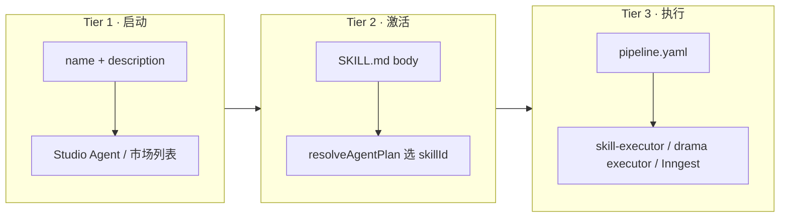

# Agent Skills 架构 — 对齐 Anthropic 开放规范

> 状态：**v1.0 架构草案 · 暂不排期** · 2026-07-06  
> **决策**：双层包（Anthropic `SKILL.md` + `pipeline.yaml`）后续补齐，**不纳入当前开发计划**；现网继续用扁平 `*.yaml` + marketplace。  
> 规范参考：[Agent Skills Specification](https://agentskills.io/specification)  
> 现状实现：`packages/agent-skills` · `@aimarket/skill-schema` · `marketplace_skills`

---

## 1. 结论（先答）

**是的，应当对齐 Anthropic Agent Skills 规范**——但 **不是替换** 现有 pipeline YAML，而是采用 **双层 Skill 包**：

| 层 | 格式 | 作用 |
|----|------|------|
| **L1 发现层** | 目录 + `SKILL.md`（frontmatter + Markdown） | 生态互通、Agent 选路、市场展示、渐进式加载 |
| **L2 执行层** | `pipeline.yaml`（AIMarket 扩展 DSL） | Inngest/executor 跑长流水线、积分预估、步骤 DAG |

Anthropic 规范管 **「Agent 何时加载什么知识」**；AIMarket DSL 管 **「后台如何逐步触发 Job」**。二者互补，业界（Cursor、Claude Code、OpenAI Codex 等）已普遍采用「标准外壳 + 产品扩展 metadata」模式。

---

## 2. 现状与缺口

### 2.1 当前格式

```
packages/agent-skills/skills/
  ecommerce-taobao-launch-v1.yaml   # 扁平 YAML，id + steps[]
  drama-short-v1.yaml
  ...
```

- 校验：`skillDefinitionSchema`（Zod）· `npx @aimarket/skill-schema validate`
- 市场：`marketplace_skills.skill_yaml` 存 **纯 pipeline YAML 字符串**
- 加载：`loadSkill(id)` 只读 `.yaml` 文件，**无** `SKILL.md`、**无** 目录包

### 2.2 与 Anthropic 规范的差异

| 维度 | Anthropic Agent Skills | AIMarket 现状 |
|------|------------------------|---------------|
| 单元 | **目录**（`skill-name/SKILL.md`） | 单文件 `.yaml` |
| 发现 | `name` + `description` frontmatter（~100 tokens） | `id` + `name` + `description` 在 YAML 根 |
| 指令体 | Markdown 步骤说明（激活后加载） | 无独立说明；步骤即机器 DSL |
| 扩展资源 | `scripts/` `references/` `assets/` | 无 |
| 生态 | 62k+ stars 仓库、第三方 market | 自有 marketplace，格式不互通 |
| 执行 | 各宿主自行解释 body | 固定 `SkillStep` discriminated union |

### 2.3 若不迁移的影响

- 用户从 Claude/Cursor 安装的 `SKILL.md` **无法**直接上架 AIMarket 市场
- Studio Agent **无法**用标准 progressive disclosure 选 Skill（只能靠 `skillId` 硬编码）
- 第三方开发者需学 **AIMarket 私有 YAML**，而非社区通用包结构

---

## 3. 目标包结构（双层）

```
ecommerce-taobao-launch-v1/
├── SKILL.md                 # L1：Anthropic 必填 frontmatter + 人类/Agent 说明
├── pipeline.yaml            # L2：AIMarket 可执行 DSL（现有 schema）
├── references/              # 可选：运营文档、步骤详解
│   └── STEPS.md
└── assets/                  # 可选：封面、示例图
    └── cover.png
```

### 3.1 `SKILL.md` frontmatter（L1）

```yaml
---
name: ecommerce-taobao-launch-v1
description: >
  淘宝/天猫上架全套：4 张电商套图 + 主图白底抠图 + 15 秒宣传片。
  在用户提到淘宝上架、电商套图、主图+视频一键交付时使用。
license: Proprietary
compatibility: Requires AIMarket API, image/video providers, ≥80 points confirm gate
metadata:
  aimarket.io/pipeline-version: "1"
  aimarket.io/pipeline-file: pipeline.yaml
  aimarket.io/category: ecommerce
  aimarket.io/confirm-if-points-over: "80"
  aimarket.io/author: aimarket-official
---
```

Markdown body：产品说明、输入要求、步骤概览、失败处理——**给 LLM 与运营读**，不替代 `pipeline.yaml`。

### 3.2 `pipeline.yaml`（L2）

保持现有 `SkillDefinition` schema 不变（`id` / `version` / `steps[]`），见 [package-format.md](./package-format.md)。

**命名空间约定**：Anthropic `metadata` 使用 `aimarket.io/*` 前缀，避免与社区 key 冲突（规范允许 arbitrary metadata）。

---

## 4. 渐进式加载（Progressive Disclosure）

对齐 agentskills.io 三级加载，映射到 AIMarket 运行时：



| Tier | 加载时机 | AIMarket 组件 |
|------|----------|---------------|
| 1 | API 启动 / 市场列表 | `listSkillsPublic()` 读 frontmatter only |
| 2 | Agent 识别用户意图匹配 | LLM planner 读 `SKILL.md` body（可选） |
| 3 | 用户确认执行 | `loadSkill()` → 解析 `pipeline.yaml` |

---

## 5. 与现有模块的关系

| 模块 | 角色 | 演进 |
|------|------|------|
| `packages/agent-skills` | 内置 Skill 包 + loader | 目录化 + 兼容旧 `.yaml` |
| `packages/skill-schema` | 第三方 CLI 校验 | 增加 `validate-package`（SKILL.md + pipeline） |
| `apps/api/lib/marketplace.ts` | 上架存储 | 存 **tar/zip 包** 或 `SKILL.md` + `pipeline.yaml` 双字段 |
| `apps/api/lib/agent/skill-executor.ts` | 执行 | 仍只消费 `SkillDefinition` |
| `docs/agents/drama/` | Plan Agent manifest | L3 Production 引用 Skill 包 id |

**Studio 创作台 Agent** 与 **短剧制作 Skill** 共用 L2 执行层，仅 L1 描述与触发语不同。

---

## 6. 用户自定义 Skill 与市场生态

### 6.1 开发者体验（目标）

```bash
# 1. 脚手架
pnpm exec aimarket-skill init my-shop-pack

# 2. 本地校验（Anthropic + AIMarket）
pnpm exec skill-validate ./my-shop-pack

# 3. 上架
curl -X POST /api/v1/marketplace/skills -F package=@my-shop-pack.zip
```

### 6.2 市场包要求（建议）

| 检查项 | 规则 |
|--------|------|
| `SKILL.md` | frontmatter 通过 agentskills.io 规则 |
| `name` | 与目录名、slug 一致 |
| `pipeline.yaml` | `@aimarket/skill-schema` Zod 通过 |
| `metadata.aimarket.io/pipeline-file` | 指向的 L2 文件存在 |
| 安全 | 禁止 bundle 可执行 `scripts/` 除非审核 + 沙箱（Phase 2） |

### 6.3 生态互通

- **Import**：允许上传仅含 `SKILL.md` 的「指令型 Skill」→ 映射为 Studio Agent 提示词包（无 pipeline，不进入 Inngest）
- **Export**：官方 Skill 发布到 GitHub 时带完整目录，可被 Claude/Cursor 用户克隆
- **Version**：`metadata.aimarket.io/pipeline-version` 与 `pipeline.yaml` 内 `version` 一致

---

## 7. 迁移路线（后续 backlog，暂不排期）

> 以下阶段 **仅作架构预留**，未列入 Sprint / Phase 计划；实现以产品排期为准。

| 阶段 | 交付 | 兼容 |
|------|------|------|
| **S0 文档** | 本目录 + 示例包 | 无行为变更 ✅ |
| **S1 Loader** | `loadSkillPackage(dir)`：优先目录，fallback 单 `.yaml` | 旧 yaml 仍可用 |
| **S2 内置迁移** | `skills/*.yaml` → `skills/*/SKILL.md` + `pipeline.yaml` | copy-skills 脚本更新 |
| **S3 市场** | 上架 API 接受 zip；DB 存 manifest 摘要 + blob | 旧 `skill_yaml` 列可双写 |
| **S4 Agent 选路** | `resolveAgentPlan` 读 Tier-1 描述匹配 skill | 可选读 body |
| **S5 生态** | curated 目录、第三方 publish CLI | scripts/ 审核策略 |

---

## 8. 示例

见 [examples/ecommerce-taobao-launch-v1/](./examples/ecommerce-taobao-launch-v1/)（L1 + L2 对照官方 `ecommerce-taobao-launch-v1.yaml`）。

---

## 9. 变更记录

| 版本 | 日期 | 说明 |
|------|------|------|
| v1.0 | 2026-07-06 | 初稿：双层包、Anthropic 对齐、迁移与市场路线 |
| v1.0.1 | 2026-07-06 | 明确 **暂不排入开发计划**；S1–S5 为 backlog |
