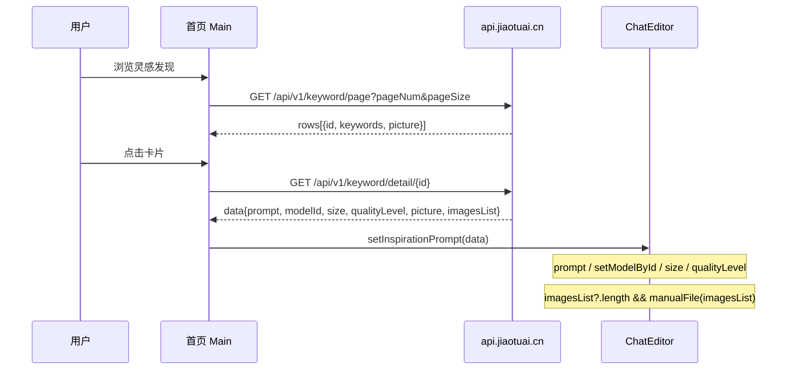

# 椒图 AI（jiaotuai.cn）竞品技术调研报告


| 项目     | 内容                                                 |
| ------ | -------------------------------------------------- |
| 文档版本   | v1.0                                               |
| 调研日期   | 2026-05-26                                         |
| 调研对象   | [https://www.jiaotuai.cn](https://www.jiaotuai.cn) |
| API 基址 | `https://api.jiaotuai.cn`                          |
| 关联产品   | AIMarket（对标实现）                                     |
| 调研方法   | 前端构建产物反编译、公开 API 实测、与 AIMarket 代码对照                |


---

## 1. 执行摘要

椒图 AI（武汉枫潮科技）采用 **Vue 3 + Vite 单页应用 + Fabric.js 画布 + 独立 REST/SSE API** 架构。核心能力不是单一模型，而是 **「运营配置灵感库 + 多模型路由 + 按能力拆分的 image 工具 API + 异步任务轮询」**。

对 AIMarket 最具参考价值的结论：

1. **灵感发现**：Prompt 来自运营后台预置模板（`keyword/detail`），非点击时实时图生文；绑定 `modelId`、比例、分辨率；参考图通过 `imagesList` + COS 上传注入工作台。
2. **主创作流**：对话模式走 `**POST /api/v1/ai/imageChat`（SSE 流式）**；积分预估 `estimatePointsBatch`。
3. **画布工具箱**：扩图/超分/消除/抠图/局部/改字/融合等均为 **独立 `/api/v1/image/`* 接口**，非统一「工具 run」；消除与抠图 API 命名易混淆（`removeBackground` 实际埋点为「无痕消除」）。
4. **主力模型族**：全能图片（偏 Nano/Gemini 系）、Seedream、Qwen/Wan、最新图片 V2(Pro) 等；对外宣称 NanoBanana Pro、Flux Kontext、Qwen Image、Seedream 4.5。

---

## 2. 整体技术架构

### 2.1 前端


| 项     | 内容                                                                   |
| ----- | -------------------------------------------------------------------- |
| 框架    | Vue 3 + Vite（`app-*.js`、`home-*.js`、`studio-*.js`、`ChatEditor-*.js`） |
| 画布    | Fabric.js（工具栏事件：`outpaint` / `erase` / `crop` / `cutout` 等）          |
| 首页工作台 | 内嵌 Chat 组件（`#chat`），非必须跳转 `/studio`                                  |
| 静态资源  | `static.jiaotuai.cn`、`cdn.jiaotuai.cn`（腾讯 COS 签名 URL）                |


### 2.2 后端 API


| 项   | 内容                                                            |
| --- | ------------------------------------------------------------- |
| 网关  | `baseURL: https://api.jiaotuai.cn`（www 域名仅为静态站）               |
| 风格  | REST + 部分 SSE；异步任务 `GET /api/v1/imageTask/taskStatus?taskId=` |
| 鉴权  | JWT `Authorization`；部分接口 `noAuth: true`（灵感列表/详情、模型列表）         |


### 2.3 多模型智能路由

[关于我们](https://www.jiaotuai.cn/about.html) 明确：**根据任务意图在顶尖图像大模型间动态切换**。

实测 `GET /api/v1/ai/queryModels`（无需登录）返回模型元数据，字段包括：

- `id`、`showModelName`、`description`
- `type`（1=全能/编辑系，2=文生图，3/4=视频）
- `resolutionList`（含「智能」+ 各比例 SVG 示意）
- `qualityLevelList`（1K/2K/4K）
- `costRadish`（积分系数）、`imageSize`（最大上传张数）
- `logoUrl`（可推断供应商：banana、nbpro、doubao、QWen 等）

**公开模型列表（实测）**


| ID  | 展示名           | type | 备注           |
| --- | ------------- | ---- | ------------ |
| 11  | 全能图片 Pro      | 1    | logo: nbpro  |
| 18  | 全能图片 V2       | 1    | logo: banana |
| 19  | 全能图片 Pro Fast | 1    |              |
| 5   | 全能图片 V1       | 1    |              |
| 16  | 最新图片 V2       | 2    |              |
| 20  | 最新图片 V2 Pro   | 2    | 灵感案例常用       |
| 17  | Seedream 5.0  | 2    | logo: doubao |
| 12  | Seedream 4.5  | 2    |              |
| 4   | Qwen Image    | 2    | logo: QWen   |
| 21  | Wan 2.7       | 2    |              |
| 14  | 万相 2.6        | 3    | 视频           |
| 15  | Seedance 2.0  | 4    | 视频           |


---

## 3. 灵感发现模块

### 3.1 用户可见行为

1. 首页瀑布流展示「灵感发现」卡片（标题 `keywords` + 封面 `picture`）。
2. 点击卡片后，**创作工作台**（首页 `#chat` 或 Studio）自动填入：
  - 完整 **Prompt**（长文本模板）
  - **模型**、**比例**、**分辨率**
  - 部分案例自动加载 **参考图**（附件区）

### 3.2 数据流（前端代码已定位）




**前端关键代码逻辑（home 构建产物）**

```javascript
async function onInspirationClick(item) {
  const { data } = await getKeywordDetail(item.id);
  data && chatRef.value?.setInspirationPrompt(data);
}

async setInspirationPrompt({ prompt, modelId, size, qualityLevel, imagesList }) {
  if (prompt) promptRef.value = prompt;
  if (modelId) {
    await modelListRef.setModelById(modelId);
    if (size) sizeRef = size;
    if (qualityLevel) qualityRef = qualityLevel;
  }
  fileRef?.reset();
  if (imagesList?.length) fileRef?.manualFile(imagesList);
}
```

### 3.3 Prompt 获取方式（结论）

**来源：运营后台预置，不是点击时调用大模型生成。**

实测 `GET /api/v1/keyword/detail/78`（「产品摄影图」）返回结构：


| 字段             | 示例/说明                                                         |
| -------------- | ------------------------------------------------------------- |
| `keywords`     | 分类标题：「产品摄影图」                                                  |
| `prompt`       | 超长中文分镜模板，含 `{argument name="product name" default="..."}` 占位符 |
| `modelId`      | `20` → 最新图片 V2 Pro                                            |
| `size`         | `"9:16"`                                                      |
| `qualityLevel` | `"2K"`                                                        |
| `picture`      | CDN 封面图 URL                                                   |
| `imagesList`   | 可为 `null` 或附件数组（多图案例）                                         |
| `isMapping`    | 布尔，是否映射多图                                                     |


Prompt 片段示例（节选）：

> 用于「Apple Pods Pro 3」无线耳机的电商信息图。前景：极具视觉冲击力的特写镜头……风格：8k 分辨率，商业产品摄影……

### 3.4 参考图自动加载


| 机制           | 说明                                                                       |
| ------------ | ------------------------------------------------------------------------ |
| `imagesList` | 非空时调用 `manualFile(imagesList)`，进入上传组件                                    |
| 上传链路         | `POST /api/v1/upload/token` → 客户端直传 COS → `POST /api/v1/upload/callback` |
| 生成请求         | `imageList: [{ ossId, url, fileName }]`，支持 `@` 引用历史图                     |
| `picture`    | 详情必返封面 URL；公开样例 `imagesList` 常为 `null`，**登录态/部分案例可能补全**（需抓包确认）           |


### 3.5 与主力模型的关系

- 灵感案例 **预绑定 `modelId`**，非每次临时 suggest。
- 案例 78 绑定 **modelId=20（最新图片 V2 Pro）**，适合复杂电商海报类模板。
- 主对话生成走 `**/api/v1/ai/imageChat`**，与灵感绑模独立。

### 3.6 相关公开接口


| 方法  | 路径                            | 鉴权          |
| --- | ----------------------------- | ----------- |
| GET | `/api/v1/keyword/page`        | 否（`noAuth`） |
| GET | `/api/v1/keyword/detail/{id}` | 否           |


**列表响应示例**

```json
{
  "code": 200,
  "msg": "查询成功",
  "total": 57,
  "rows": [
    {
      "id": 78,
      "keywords": "产品摄影图",
      "picture": "https://cdn.jiaotuai.cn/...jpeg?sign=...",
      "createTime": "2026-05-01 23:59:43"
    }
  ]
}
```

---

## 4. 主创作流（对话 / 快速 / 电商）

### 4.1 对话模式（Standard）


| 项    | 内容                                                                |
| ---- | ----------------------------------------------------------------- |
| 主接口  | `POST /api/v1/ai/imageChat`                                       |
| 协议   | **SSE**（`fetch-event-source`，`[DONE]` 结束）                         |
| 请求   | JSON：`prompt`、`modelId`、`size`、`qualityLevel`、`imageList`（ossId）等 |
| 模式字段 | `requestMode`: `standard` / `quick` / `taotu`（套图）                 |


### 4.2 辅助接口


| 方法   | 路径                               | 用途             |
| ---- | -------------------------------- | -------------- |
| GET  | `/api/v1/ai/queryModels`         | 模型列表           |
| GET  | `/api/v1/ai/queryModel`          | 单模型详情          |
| POST | `/api/v1/ai/estimatePointsBatch` | 积分预估           |
| POST | `/api/v1/prompt/optimize`        | Prompt 润色（魔术棒） |
| GET  | `/api/v1/imageTask/taskStatus`   | 异步任务轮询         |


### 4.3 电商套图 Agent


| 方法   | 路径                                  |
| ---- | ----------------------------------- |
| GET  | `/api/v1/productSet/init`           |
| GET  | `/api/v1/productSet/models`         |
| POST | `/api/v1/productSet/confirm`        |
| POST | `/api/v1/productSet/estimatePoints` |


### 4.4 图生文（反推，非灵感库）


| 方法   | 路径                                           | 埋点        |
| ---- | -------------------------------------------- | --------- |
| POST | `/api/v1/image/originalImagePromptReverse`   | 原始画面提示词反推 |
| POST | `/api/v1/image/templateSummaryPromptReverse` | 模板总结提示词反推 |


---

## 5. Studio 画布 Dock 工具箱

### 5.1 产品与 API 对照（前端埋点 + POST 路径）


| 产品功能    | HTTP 接口                               | 前端埋点             | 技术推断                    |
| ------- | ------------------------------------- | ---------------- | ----------------------- |
| AI 扩图   | `POST /api/v1/image/extendImage`      | `studio:AI智能扩图`  | Outpainting / 扩边生成      |
| AI 超清放大 | `POST /api/v1/image/upscaling`        | `studio:图片高清化`   | multipart 超分            |
| 图片变清晰   | `POST /api/v1/image/enhance`          | `studio:图片变清晰`   | 锐化/轻量增强（与超分拆分）          |
| AI 智能消除 | `POST /api/v1/image/removeBackground` | `studio:AI无痕消除`  | **Inpainting 抹除**（非抠图）  |
| 一键抠图    | `POST /api/v1/image/cutout`           | `studio:抠图`      | Matting 去背              |
| 局部修改    | `POST /api/v1/image/partialEdit`      | `studio:局部修改`    | 蒙版 + 局部重绘               |
| 无痕改字    | `POST /api/v1/image/editText`         | `studio:无痕改字`    | OCR + 文字区域重绘            |
| 多图融合    | `POST /api/v1/image/uploadGenerate`   | `studio:多图融合`    | 多参考图合成生成                |
| 图片裁剪    | （无独立 image API）                       | —                | **Fabric.js 客户端 Crop**  |
| 视频生成    | `POST /api/v1/image/video_generation` | `studio:首尾帧视频生成` | Seedance / 万相           |
| 焦点编辑    | `POST /api/v1/focus/getImagePoint` 等  | `studio:焦点识别`    | 点选 + `splicingImagInfo`；AIMarket 规格见 `docs/spec/FOCUS_EDIT.md` |


### 5.2 画布技术要点

- 工具栏通过 Fabric 发出 `outpaint` / `erase` / `crop` 等事件，父组件映射到上表 API。
- **扩图** → `extendImage`；**消除** → `removeBackground`；**裁剪** →  primarily 前端。
- `upscaling` 使用 `FormData` multipart；其余多为 JSON POST。

### 5.3 会话与资产


| 方法   | 路径                                        |
| ---- | ----------------------------------------- |
| GET  | `/api/v1/imageSession/imagePage`          |
| POST | `/api/v1/imageSession/updateImageSession` |
| GET  | `/api/v1/image/list`                      |
| POST | `/api/v1/upload/token`                    |
| POST | `/api/v1/upload/callback`                 |


---

## 6. 账户与增长（节选）


| 方法   | 路径                           |
| ---- | ---------------------------- |
| POST | `/api/v1/user/login`         |
| POST | `/api/v1/user/sendPhoneCode` |
| GET  | `/api/v1/user/wxCode`        |
| GET  | `/api/v1/user/getInfo`       |
| GET  | `/api/v1/user/queryPoints`   |
| GET  | `/api/v1/sign/check`         |
| POST | `/api/v1/sign/getSing`       |


---

## 7. AIMarket 现状对比


| 能力   | 椒图                     | AIMarket（当前 main）               |
| ---- | ---------------------- | ------------------------------- |
| 前后端  | 分离（Vue SPA + API）      | **分离**（Next.js + Hono API）      |
| 后端语言 | 未公开（非 Go 特征）           | **TypeScript (Node)**，非 Go      |
| 灵感库  | `keyword/`* API + 运营配置 | 静态 `inspiration.ts`             |
| 灵感附图 | COS + `manualFile`     | 仅 URL 传 prompt                  |
| 主生成  | SSE `imageChat`        | REST `ai/generate` + job 轮询/SSE |
| 工具   | 10+ `/image/*` 专用接口    | 统一 `tools/:id/run` → mock job   |
| 上传   | token + callback       | `assets` 本地上传                   |
| 登录   | 手机/微信/邮箱               | 邮箱 + 手机/微信 mock                 |


---

## 8. 风险与合规说明

- 本报告基于 **公开页面、可访问 API、前端构建产物** 分析，不涉及未授权渗透。
- 模型供应商与密钥配置在后端，无法从客户端 100% 确认每次调用的上游模型版本。
- 建议 AIMarket 对标时：**接口形态与产品流** 可复用，**密钥与模型合同** 需独立采购。

---

## 9. 是否采用椒图方案「原样复刻」

**结论：否。** 椒图在灵感运营、画布工具产品化、对象存储直传等方面值得借鉴；其 **多套 API（imageChat / image/* / imageTask）、工具路由膨胀、误导性命名（removeBackground=消除）** 不适合作为 AIMarket 长期架构。

AIMarket 推荐在体验对齐前提下，采用：

- 统一 `generation_jobs` + `POST /ai/generate` + `POST /tools/:toolId/run` + `GET /ai/jobs/:id/stream`
- 灵感内部域 `inspiration_templates`，对外可选 `/keyword/*` 别名
- 工具注册表 + Provider，而非 10 条独立 image 路由

详见：**[架构优化方案](../spec/JIAOTU_OPTIMIZED_DESIGN.md)**、修订后排期 **[JIAOTU_PARITY_BACKLOG.md](../spec/JIAOTU_PARITY_BACKLOG.md)**。

---

## 10. 参考文献

- 椒图官网：[https://www.jiaotuai.cn/](https://www.jiaotuai.cn/)
- 椒图关于我们：[https://www.jiaotuai.cn/about.html](https://www.jiaotuai.cn/about.html)
- AIMarket PRD：`docs/PRD.md`
- AIMarket 技术规格：`docs/TECH_SPEC.md`

