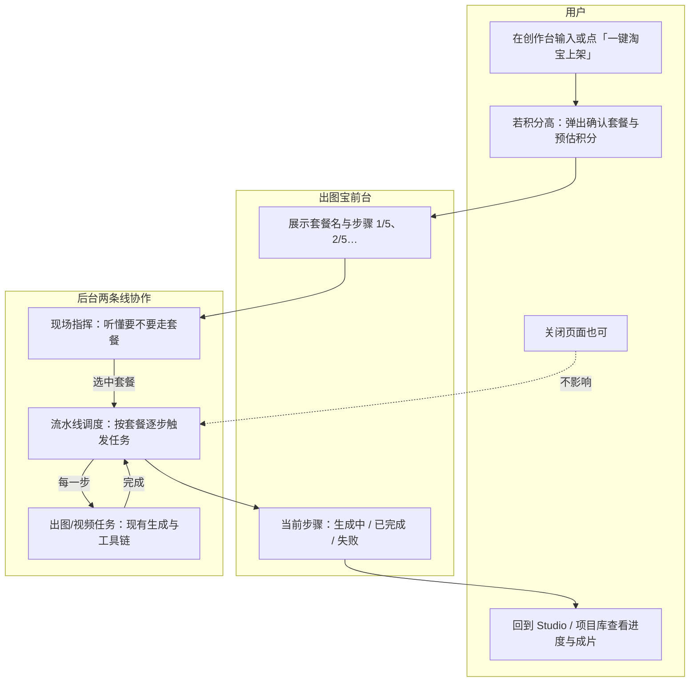
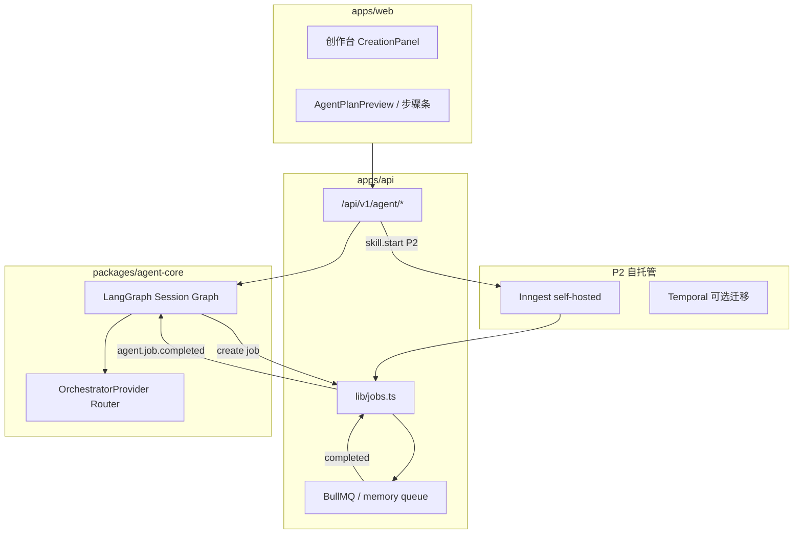

# Agent 编排技术规格（LangGraph.js + 自托管 Inngest/Temporal）

| 项目 | 内容 |
|------|------|
| 版本 | v0.1（P0+P1 基线） |
| 日期 | 2026-06-01 |
| 状态 | P0–P3.3 已落地；P3.4 为创作台展示与生产配置抛光 |
| 关联 | [TECH_SPEC.md](../TECH_SPEC.md) · [PROJECT_WORKFLOW.md](../PROJECT_WORKFLOW.md) · [JIAOTU_OPTIMIZED_DESIGN.md](./JIAOTU_OPTIMIZED_DESIGN.md) |

---

## 1. 目标与边界

### 1.1 产品目标

1. **编程型创作 Agent**：根据自然语言意图，规划并执行文生图、图生图、现有 `STUDIO_TOOLS` 工具链，行为类似 Cursor/Trae 的「计划 → 工具 → 观察 → 再计划」循环。
2. **标准化电商 Skill（P2+）**：一键套图 + 精修 + 宣传短视频等长流水线，可版本化、可运营。
3. **创作台协同**：底部 Dock（`CreationPanel`）负责确认、补 mask/选图、步骤与 Job 进度；Agent 负责编排，不替代 `generation_jobs` 执行内核。

### 1.2 技术边界

| 做 | 不做 |
|----|------|
| 编排 LLM（GLM / Qwen / DeepSeek 优先，OpenAI/Claude 可选） | 用生图/视频模型做多步规划 |
| LangGraph.js 管理会话内短循环（秒～分钟） | 在 Hono 请求线程内阻塞 poll Job |
| 自托管 Inngest（P2）/ Temporal（P2+）跑长 Skill | 复制椒图 `imageChat` 独立 SSE 协议 |
| 统一 `POST /tools/:id/run` + `createGenerationJob` | 为 Agent 新增 10+ 平行图像 API |

### 1.3 与现网组件映射

| 用户概念 | 代码 |
|----------|------|
| 创作台 | `StudioDock` + `CreationPanel` |
| 画布 | `DesignCanvas` + `useSessionCanvas` |
| 工具链 | `STUDIO_TOOLS` + `POST /api/v1/tools/:toolId/run` |
| 生成 Job | `generation_jobs` + BullMQ + `GET /ai/jobs/:id/stream` |
| 旧 Agent 计划 | `POST /agent/plan`（关键词）→ 升级为 LLM + 规则 fallback |

---

## 1.4 产品可读：长 Skill 是什么？（运营 / 非后端）

> 本节不讲代码，只说明 **用户看到什么**、**系统后台怎么串起来**。

### 一句话

**长 Skill = 运营配置好的「套餐流水线」**：用户点一次「淘宝上架全套」，系统自动按固定顺序完成 **套图 → 抠图 → 宣传片**，中途可关页面，后台继续跑。

### 和「创作台 Agent」的区别

| | 创作台 Agent（已上线） | 长 Skill（P2） |
|---|----------------------|----------------|
| 用户怎么说 | 「先抠图再超分」等 **即兴指令** | 「一键淘宝上架」等 **套餐名** |
| 步骤谁定 | 当场分析（智能/规则） | **运营事先写好**（可版本 v1、v2） |
| 大概多久 | 几秒～几分钟 | 通常 **10～30 分钟** |
| 典型场景 | 单张精修、2～3 步小流程 | 4 张套图 + 抠图 + 15 秒视频 |

### 整体流程图（用户视角）



**类比**：创作台 Agent 像 **服务员根据你现点的菜一道道上**；长 Skill 像 **婚宴套餐**，厨房按单子自动推进，不用每道菜都再点一次。

### 例子：「淘宝上架全套」Skill（`ecommerce-taobao-launch-v1`）

**适合谁**：淘宝/天猫卖家，已有 **商品图**，要 **主图+套图+白底主图+短视频** 一起交付。

**用户要准备的**

| 必填 | 说明 |
|------|------|
| 商品图 | 上传一张实物或白底图 |
| 产品描述 | 卖点、规格、受众（用于生成文案与画面） |
| 平台 | 默认「淘宝」 |

**套餐里固定 5 步（运营可改版本号升级）**

| 步骤 | 用户看到的名称 | 系统实际做什么 | 大概产出 |
|------|----------------|----------------|----------|
| 1 | 生成电商套图（4 张） | 按套图模板出：主图 / 卖点 / 场景 / 详情 | 4 张图进画布 |
| 2 | 主图抠白底 | 对第 1 步「主图」做抠图 | 1 张透明底 PNG |
| 3 | 生成 15 秒宣传片 | 用白底主图生成宣传短视频 | 1 段视频 |
| 4 | （可选后续）导出提示 | 引导去项目库打包下载 | — |

**积分与确认（产品规则）**

- 提交前展示 **整包预估积分**（例如 80 分以上需点「确认执行」）。
- 任一步失败：**积分按现有规则退回该步**，套餐可标记失败并提示用户重试或联系客服。

**用户在前台看到的状态示例**

```
套餐：淘宝上架全套 v1
状态：执行中 · 步骤 2/3
✓ 1. 电商套图（4 张）
→ 2. 主图抠白底（生成中…）
  3. 15 秒宣传片
```

### 自托管 Inngest（给运营/运维的一句话）

- **Inngest** = 后台「流水线调度员」，只负责 **排队、等上一步完成、再触发下一步**；真正出图仍用现有系统。
- **自托管** = 调度服务跑在 **出图宝自己的服务器**，不依赖国外 SaaS，数据留在场内。
- **对运营的意义**：套餐步骤可在配置文件里改版（v1→v2），无需每次改前端按钮逻辑。

---

## 2. 总体架构



### 2.1 进程模型

| 进程 | 职责 | 阶段 |
|------|------|------|
| `apps/api` | HTTP、鉴权、`agent_runs`、触发 Graph、Job 完成回调 | P0+ |
| `apps/agent-worker`（可选） | 专消费 Job 事件 resume Graph（高负载时拆出） | P1.5+ |
| `apps/workflow-worker` | Inngest/Temporal worker | P2 |
| 现有 BullMQ worker | 仅图像/视频生成 | 不变 |

**P1 默认**：Graph 在 API 进程内通过 Job 完成钩子 `resume`；与独立 worker 共用 `@aimarket/agent-core`。

---

## 3. 编排模型层（P0）

### 3.1 模型分工

| 类型 | 用途 | 接入 |
|------|------|------|
| **编排 LLM** | 意图、Plan、Skill 选路、澄清 | `OrchestratorProvider` |
| **生图/图生图** | 实际出图 | 现有 `providers/registry` |
| **工具 Provider** | 抠图/扩图等 | 现有 `providers/tools` |
| **视频** | 宣传片 | 现有 `providers/video` |
| **VLM**（P3） | 出图质检、选 hero | 独立 provider |

### 3.2 厂商与优先级

| 优先级 | 厂商 | 默认模型 env | 协议 |
|--------|------|--------------|------|
| 1 | DeepSeek | `AGENT_LLM_DEEPSEEK_MODEL=deepseek-chat` | OpenAI-compatible |
| 2 | Qwen（DashScope） | `AGENT_LLM_QWEN_MODEL=qwen-max` | compatible-mode/v1 |
| 3 | 智谱 GLM | `AGENT_LLM_GLM_MODEL=glm-4-plus`（GLM-5 发布后改配置） | v4 chat/completions |
| 可选 | OpenAI | `AGENT_LLM_OPENAI_MODEL=gpt-4o-mini` | 官方 API |
| 可选 | Claude | `AGENT_LLM_CLAUDE_MODEL=claude-sonnet-4-20250514` | Messages API 独立 adapter |

### 3.3 环境变量

```bash
# 主备链（逗号分隔）
AGENT_LLM_PRIMARY=deepseek
AGENT_LLM_FALLBACKS=qwen,glm,openai

# 是否允许海外模型
AGENT_LLM_ALLOW_OVERSEAS=false

# 各厂商 Key / Base（OpenAI-compatible 三家）
DEEPSEEK_API_KEY=
DEEPSEEK_BASE_URL=https://api.deepseek.com/v1
DASHSCOPE_API_KEY=
DASHSCOPE_LLM_BASE_URL=https://dashscope.aliyuncs.com/compatible-mode/v1
ZHIPU_API_KEY=
ZHIPU_BASE_URL=https://open.bigmodel.cn/api/paas/v4

OPENAI_API_KEY=
ANTHROPIC_API_KEY=

# 无 Key 时仅用规则 planner
AGENT_LLM_ENABLED=true
```

### 3.4 路由与降级

1. `AGENT_LLM_ENABLED=false` 或无任何 Key → **仅规则** `buildRuleAgentPlan`（原 `planner.ts` 逻辑）。
2. Primary 失败（429/5xx/超时/JSON 解析失败）→ 按 `FALLBACKS` 依次尝试。
3. 全部失败 → 规则 planner + `plan.source = "rule"` 写入 run 元数据。

### 3.5 Structured Plan Schema

与前端 `AgentPlan` 兼容（`apps/web/src/lib/types.ts`）：

```typescript
interface AgentPlan {
  intent: string;
  modelId: string;
  mode: string;
  resolution: string;
  aspectRatio: string;
  count: number;
  steps: Array<{
    type: "generate" | "tool" | "video"; // video P2
    toolId?: string;
    label: string;
    prompt?: string;
    dependsOn?: string;
  }>;
  estimatedPoints: number;
  requiresConfirm: boolean;
  reason: string;
  skillId?: string; // P2
  planSource?: "llm" | "rule";
}
```

LLM 只产出 `steps` + `intent` + `skillId`；**积分与 modelId** 由 API 层 `enrichAgentPlan()` 根据 `suggestModel` / `estimatePoints` 补全。

---

## 4. LangGraph 会话图（P1）

### 4.1 State

```typescript
interface AgentSessionState {
  runId: string;
  sessionId: string;
  userId: string;
  prompt: string;
  mode: string;
  confirmed: boolean;
  plan: AgentPlan | null;
  currentStepIndex: number;
  pendingJobId: string | null;
  observations: JobObservation[];
  status:
    | "planning"
    | "waiting_confirm"
    | "running"
    | "waiting_job"
    | "completed"
    | "failed"
    | "cancelled";
  error?: string;
}
```

### 4.2 节点

| 节点 | 行为 |
|------|------|
| `plan` | 调用 `resolveAgentPlan`（LLM → 规则） |
| `confirm_gate` | `requiresConfirm && !confirmed` → 结束，`waiting_confirm` |
| `execute_step` | 对 `steps[currentStepIndex]` 调 API adapter 创建 Job |
| `wait_job` | 有 `pendingJobId` 时 `interrupt({ jobId })` |
| `observe` | 合并 Job 结果到 `observations` |
| `advance` | `currentStepIndex++`，若还有步骤 → `execute_step`，否则 `completed` |

### 4.3 Checkpoint

- **thread_id** = `agent_run.id`
- P1：`MemorySaver` + 每步将 `state_json` 写入 `agent_runs` 表
- P1.5+：Redis / SQLite checkpointer

### 4.4 Job 完成恢复

```
generation_jobs.status → succeeded | failed
        ↓
emitAgentJobCompleted({ jobId, runId?, observation })
        ↓
graph.invoke(Command({ resume: observation }), { configurable: { thread_id: runId }})
```

`agent_run_jobs` 表关联 `run_id` + `job_id` + `step_index`。

---

## 5. 数据模型

### 5.1 `agent_runs`

| 列 | 类型 | 说明 |
|----|------|------|
| id | TEXT PK | UUID |
| session_id | TEXT FK | image_sessions |
| user_id | TEXT FK | users |
| status | TEXT | 见 §4.1 |
| prompt | TEXT | 用户输入 |
| mode | TEXT | chat / image / ecommerce |
| plan_json | TEXT | AgentPlan JSON |
| current_step_index | INTEGER | 当前步骤 |
| pending_job_id | TEXT | 等待中的 Job |
| state_json | TEXT | LangGraph 快照（可选） |
| plan_source | TEXT | llm / rule |
| skill_id | TEXT | P2 |
| error | TEXT | |
| created_at / updated_at | TEXT | |

### 5.2 `agent_run_jobs`

| 列 | 说明 |
|----|------|
| run_id | FK agent_runs |
| job_id | FK generation_jobs |
| step_index | 步骤序号 |

SQLite：`apps/api/src/db/index.ts`  
PostgreSQL：`apps/api/src/db/migrations/postgres.sql`

---

## 6. HTTP API

### 6.1 现有（保持兼容）

| 方法 | 路径 | 说明 |
|------|------|------|
| POST | `/api/v1/agent/plan` | 预览计划；P0 起走 LLM+fallback |
| POST | `/api/v1/agent/execute` | 单次执行（**已废弃**）；电商套图请用 `POST /agent/skills/:skillId/runs` |

### 6.2 P1 新增

| 方法 | 路径 | 说明 |
|------|------|------|
| POST | `/api/v1/agent/runs` | 创建 run 并启动 Graph |
| GET | `/api/v1/agent/runs/:id` | 状态、plan、步骤、pendingJob、observations |
| POST | `/api/v1/agent/runs/:id/confirm` | 确认后继续 |
| POST | `/api/v1/agent/runs/:id/cancel` | 取消 |

### 6.3 创作台消费

- 挂载 `AgentPlanPreview` → `GET /runs/:id` 或创建前 `POST /plan`
- 步骤条：`currentStepIndex` / `steps.length` / `status`
- `waiting_confirm` → 确认按钮调 `confirm`
- Job SSE 仍走现有 `/ai/jobs/:id/stream`；run 状态轮询或 SSE（P1.5）

---

## 7. 长 Skill：自托管 Inngest / Temporal（P2）

### 7.1 选型

| 引擎 | 场景 | 部署 |
|------|------|------|
| **Inngest**（推荐先行） | 套图+视频、分钟级、事件驱动 | 自托管 [Inngest Dev Server](https://www.inngest.com/docs/self-hosting) 或 Docker Compose |
| **Temporal** | 复杂 saga、跨天续跑、强补偿 | 自建 Temporal Server + `apps/workflow-worker` |

与现有 **BullMQ** 关系：BullMQ 继续负责**单 Job 执行**；Inngest/Temporal 负责**跨 Job 编排**。

### 7.2 Skill 定义（`packages/agent-skills`）

YAML：`id`、`version`、`steps[]`、`confirmIfPointsOver`、`onStepFailed`。

示例 Skill：`ecommerce-taobao-launch-v1`（主图套图 → 抠图 → 15s 视频）。

### 7.3 与 LangGraph 衔接

- LangGraph `plan` 识别 `skillId` → 发送 `agent/skill.started` → Inngest Function
- Run 状态 `waiting_skill` → Skill 完成事件 → resume LangGraph `observe`

### 7.4 自托管参考拓扑（P2）

```
docker-compose:
  - inngest (或 temporal + ui)
  - redis (已有，BullMQ + 可选 Inngest)
  - aimarket-api
  - aimarket-workflow-worker
```

---

## 8. 安全与合规

- 编排 LLM 请求记录：`run_id`、token 用量、provider，**不**记录 base64 图片。
- 与用户 BYOK 生图 Key **分离**；Workspace 级 `orchestrator_preference`（P3）。
- `requiresConfirm` + Skill `confirmIfPointsOver` 双保险。
- 现有 `assertPromptAllowed` / `assertOutputsAllowed` 仍在 Job 创建与完成处执行。

---

## 9. Monorepo 结构

```
aimarket/
├── packages/agent-core/       # P0+P1：LLM router、Plan、LangGraph
├── packages/agent-skills/     # P2：YAML skills
├── apps/api/                  # HTTP、DB、Job 钩子、agent routes
│   └── src/lib/agent/         # resolve-plan、runs、runner、job-events
├── apps/agent-worker/         # P1.5+：可选独立消费者
└── apps/workflow-worker/      # P2：Inngest/Temporal
```

### 9.1 已实现文件索引（P0+P1）

| 路径 | 说明 |
|------|------|
| `packages/agent-core/src/llm/router.ts` | GLM/Qwen/DeepSeek/OpenAI/Claude 路由 |
| `packages/agent-core/src/plan/llm-planner.ts` | 结构化 Plan |
| `packages/agent-core/src/graph/session-graph.ts` | LangGraph 会话图 |
| `apps/api/src/lib/agent/resolve-plan.ts` | LLM + 规则 enrich |
| `apps/api/src/lib/agent/runner.ts` | 启动 / 确认 / Job resume |
| `apps/api/src/routes/agent.ts` | `/plan`、`/runs/*` |

---

## 10. 实施阶段

| 阶段 | 交付 | 验收 |
|------|------|------|
| **P0** ✅ | `@aimarket/agent-core` LLM router + `resolveAgentPlan`；`/agent/plan` 使用 LLM+fallback | 无 Key 时规则计划；有 Key 时返回 `planSource: llm` |
| **P1** ✅ | `agent_runs` 表、Session Graph、Job 完成 resume、`/agent/runs/*` | 创建 run → 执行首步 Job → 完成后 advance 或结束 |
| **P1.5** ✅ | `AgentRunPanel` 接 `/agent/runs`；步骤高亮与确认 | Studio 创作台 Dock |
| **P2** ✅ | 自托管 Inngest + `ecommerce-taobao-launch-v1` + `workflow-worker` | 一键套图+视频端到端 |
| **P2.5** ✅ | `SkillPackagePicker` + `SkillRunPanel` 接 `/agent/skills` | Studio 选套餐与步骤进度 |
| **P2.6** ✅ | Skill Job 完成事件 `resumeSkillRunOnJobCompleted` | 非阻塞编排，适配 Inngest |
| **P3** ✅ | VLM observe、步骤质检重试（`AGENT_VLM_ENABLED`） | 失败可重试当前步 |
| **P3.1** ✅ | SQLite checkpointer + DB fallback resume | API 重启后续跑 Agent Run |
| **P3.2** ✅ | Skill VLM 选 hero（`heroOutputIndex`） | 套图主图索引 |
| **P3.3** ✅ | Redis LangGraph checkpointer（`@langchain/langgraph-checkpoint-redis@0.0.2`） | 多 API 实例 |
| **P3.4** ✅ | API/UI 暴露 `heroOutputIndex`；生产 Agent 环境变量文档 | 运营可见主图选择 |

---

## 11. 配置示例（开发）

```bash
AGENT_LLM_ENABLED=true
AGENT_LLM_PRIMARY=deepseek
AGENT_LLM_FALLBACKS=qwen,glm
DEEPSEEK_API_KEY=sk-...
```

---

## 12. 变更记录

| 版本 | 日期 | 说明 |
|------|------|------|
| v0.1 | 2026-06-01 | 初稿；P0+P1 基线实现 |
| v0.1.1 | 2026-06-01 | 落地 `packages/agent-core`、`agent_runs`、`/agent/runs/*`、Job 完成 resume |
| v0.2 | 2026-06-01 | §1.4 产品可读；P2 `agent-skills`、skill_runs、Inngest worker |
| v0.2.1 | 2026-06-01 | #102 Skill Job 调度修复；P2.6 事件驱动续跑 |
| v0.3 | 2026-06-01 | P3 VLM observe + 步骤重试（`AGENT_VLM_ENABLED`） |
| v0.3.1 | 2026-06-01 | P3.1 Sqlite checkpointer + `resumeAgentRunFromDb` |
| v0.3.2 | 2026-06-01 | P3.2 Skill VLM 选 hero（`pick-hero.ts`） |
| v0.3.3 | 2026-06-01 | P3.3 `RedisSaver.fromUrl` + `REDIS_URL`；失败回退 sqlite |
| v0.3.4 | 2026-06-01 | P3.4 套图主图索引 API/UI + 生产配置说明 |
