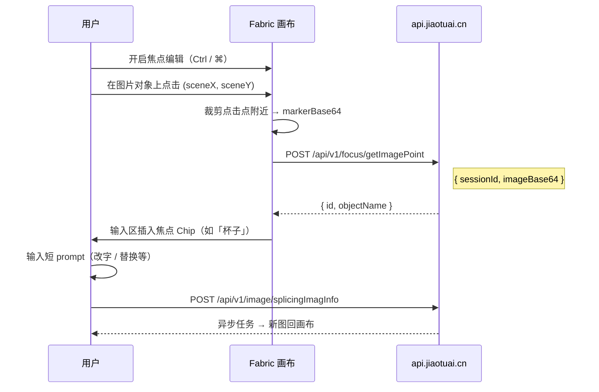

# 焦点编辑（Focus Edit）— 产品规格与 AIMarket 实现方案

| 项目 | 内容 |
|------|------|
| 版本 | v1.0 |
| 日期 | 2026-05-28 |
| 对标 | 椒图 AI Studio「焦点编辑」（原快捷键单独 Ctrl/⌘；AIMarket 改为 **⌘⇧F / Ctrl+Shift+F** 避免与复制冲突） |
| 参考 | [飞书：焦点编辑用法](https://my.feishu.cn/wiki/OHECwnf0hiztE0kj8wCc89ySnpb) · `docs/research/JIAOTUAI_RESEARCH_REPORT.md` §5.1 |
| 架构约束 | 遵循 `docs/spec/JIAOTU_OPTIMIZED_DESIGN.md`：统一 Job + `POST /tools/:toolId/run`，不新增椒图式 `/image/*` 一等公民路由 |

---

## 1. 产品定义

**焦点编辑**：用户在画布图片上**点击一个点**，系统识别该位置对应的物体/区域，生成一个**焦点标记（Chip）**；用户再用**极短的中文 prompt** 描述要如何改这一块——包括改字、改属性、或**整物替换**——最后走统一生成任务出图。

### 1.1 核心价值

- **精准锁定目标区域**，避免「整张图 + 长 prompt」导致模型改错地方。
- **短 prompt 即可**（飞书案例：改字仅 6 个字「改成需求」）。
- **减少反复抽卡与积分浪费**。

### 1.2 能力矩阵

| 场景 | 用户操作 | Prompt 示例 | `intent` |
|------|----------|-------------|----------|
| 无痕改字 | 点在文字区域 | `改成「需求」` | `edit` |
| 局部修改 | 点在物体/区域 | `改成红色`、`加金属质感` | `edit` |
| **对象替换** | 点在要被换掉的物体 | `换成红色花瓶` | `replace` |
| 参考替换 | 点选物体 + `@` 另一张参考图 | `替换成附件图里的杯子` | `replace` |

> **对象替换**与局部修改的技术路径相同（局部重绘），差异在 prompt 模板与 UI 文案。

### 1.3 与 AIMarket 现有工具对比

| 工具 | 选区方式 | 典型用途 |
|------|----------|----------|
| `inpaint` | 用户手动画笔/框选蒙版 | 任意形状区域重绘 |
| `text` | 专用「无痕改字」流程 | 文字区域 OCR + 重绘 |
| `erase` | 画笔涂抹 | 消除杂物 |
| **`focus-edit`** | **点击图片坐标，AI 自动识别物体** | 改字 / 局部改 / **对象替换** |

---

## 2. 椒图对标（逆向 + 飞书文档）

### 2.1 交互流程



### 2.2 椒图 API（仅作兼容参考，AIMarket 不原样复制）

| 步骤 | 椒图路径 | 埋点 | 请求要点 |
|------|----------|------|----------|
| 点选识别 | `POST /api/v1/focus/getImagePoint` | `studio:焦点识别` | `{ sessionId, imageBase64 }` |
| 固定 prompt（拖拽图可选） | `POST /api/v1/focus/getImageFixedPrompt` | — | `{ sessionId }` |
| 生成 | `POST /api/v1/image/splicingImagInfo` | `studio:焦点编辑生成` | 焦点列表 + 用户 prompt |

识别结果字段：

- `id` → 前端 `pointId`
- `objectName` → 前端 `recognitionName`（Chip 展示名，空则「未命名焦点」）

### 2.3 前端行为要点（椒图 ChatEditor 逆向）

- 工具栏按钮「焦点编辑」，快捷键 **⌘⇧F / Ctrl+Shift+F**（单独 Ctrl/⌘ 会与复制粘贴冲突，已弃用）。
- 焦点模式开启后：画布 `mouse:down` 防抖（约 1.5s），禁用多选/历史。
- 单次会话最多 **10** 个焦点标记。
- 富文本编辑器支持 `focusMarker` 节点（`attrs.key` 关联焦点）。
- 拖拽图片到焦点区可走 `getImageFixedPrompt` 分支（AIMarket 二期可选）。

---

## 3. AIMarket Canonical 设计

### 3.1 原则

1. **识别**与**生成**拆成两个 API，但都挂在 Canonical 域下。
2. **生成**走现有 `POST /api/v1/tools/focus-edit/run` → `generation_jobs`，与 cutout/inpaint 一致。
3. 椒图 `/focus/*`、`/image/splicingImagInfo` 仅在 `COMPAT_JIAOTU_ALIASES=true` 时作为别名转发（P5 可选，本功能不阻塞）。

### 3.2 API 一览

| 方法 | 路径 | 说明 |
|------|------|------|
| `POST` | `/api/v1/focus/point` | 焦点识别：点击处裁剪图 → `pointId` + `objectName` |
| `POST` | `/api/v1/tools/focus-edit/run` | 焦点编辑生成：提交 job |
| `GET` | `/api/v1/tools/list` | 列表含 `focus-edit` 工具元数据 |

#### `POST /api/v1/focus/point`

**请求**

```json
{
  "sessionId": "uuid",
  "imageUrl": "https://.../source.jpg",
  "x": 0.42,
  "y": 0.55,
  "cropSize": 128
}
```

| 字段 | 类型 | 必填 | 说明 |
|------|------|------|------|
| `sessionId` | uuid | 是 | 会话 |
| `imageUrl` | string | 是* | 源图 URL（与 `imageBase64` 二选一） |
| `imageBase64` | string | 否 | 客户端已裁剪的 marker 图（椒图兼容） |
| `x`, `y` | number | 否 | 归一化坐标 0–1；无 base64 时服务端按坐标裁剪 |
| `cropSize` | number | 否 | 裁剪边长，默认 128 |

**响应**

```json
{
  "data": {
    "pointId": "fp_abc123",
    "objectName": "杯子",
    "provider": "focus-mock"
  }
}
```

#### `POST /api/v1/tools/focus-edit/run`

**请求**（在现有 `ToolRunBody` 上扩展）

```json
{
  "sessionId": "uuid",
  "prompt": "换成红色花瓶",
  "referenceOutputIds": ["output-uuid-of-source-image"],
  "intent": "replace",
  "focusPoints": [
    {
      "pointId": "fp_abc123",
      "objectName": "杯子",
      "x": 0.42,
      "y": 0.55
    }
  ],
  "referenceUrls": ["https://.../ref-vase.jpg"]
}
```

| 字段 | 类型 | 必填 | 说明 |
|------|------|------|------|
| `prompt` | string | 是 | 用户短指令 |
| `referenceOutputIds` | uuid[] | 是 | 被编辑的源图 output |
| `focusPoints` | array | 是 | 至少 1 个焦点，最多 10 个 |
| `intent` | `edit` \| `replace` | 否 | 默认 `edit` |
| `referenceUrls` / `assetIds` | | 否 | 替换参考图 |

**响应**：与其它工具相同，`{ data: { jobId } }`。

### 3.3 Prompt 模板（服务端拼进供应商）

**局部修改（`intent=edit`）**

```text
仅修改画面中「{objectName}」区域：{userPrompt}。其余区域保持不变，光影与透视一致。
```

**对象替换（`intent=replace`）**

```text
将画面中「{objectName}」替换为：{userPrompt}。保持周围背景、光影与透视一致，融合自然。
```

多焦点时前缀：

```text
针对以下焦点分别处理：{objectName1}、{objectName2}。{userPrompt}
```

有 `referenceUrls` 时追加：`参考附件图中的物体形态与材质。`

### 3.4 工具注册表

```typescript
{
  id: "focus-edit",
  name: "焦点编辑",
  description: "点击图片识别物体，短 prompt 精准改字、局部修改或对象替换",
  category: "edit",
  defaultPrompt: "改成",
  pricingFactor: 1.2,
  requiresSource: true,
  legacyAliases: ["focusEdit", "splicingImagInfo"],
}
```

### 3.5 前端交互模式

在 `studio-workspace` 的 `TOOL_INTERACTIONS` 中新增：

```typescript
"focus-edit": "click",
```

| 模式 | 行为 |
|------|------|
| `click` | 开启焦点模式 → 点击图片 → 调 `/focus/point` → 插入 Chip → 用户输入 prompt → 提交 `focus-edit/run` |

**UI 组件（计划）**

- `FocusEditMode`：画布点选态、Chip 列表（序号、预览缩略图、可编辑名称、删除）。
- Dock / 工具栏：「焦点编辑」入口 + 快捷键提示。
- 输入框：焦点 Chip 与 `@` 引用图并存（MVP 可用文本 `@焦点:杯子`）。

### 3.6 Provider 与回落

| 阶段 | 识别 (`/focus/point`) | 生成 (`focus-edit/run`) |
|------|----------------------|-------------------------|
| MVP | `focus-mock`（固定 objectName 或简单启发） | 复用 `tool-seedream` / `tool-edit-mock` + prompt 模板 |
| P2 | 通义视觉 / 火山多模态「描述点击处物体」 | Seedream 编辑 API |
| P3 | SAM2 / 阿里分割（出 mask，与 inpaint 共用） | FLUX Fill / 专用 inpaint |

环境变量（生成层复用现有）：

- `TOOL_EDIT_PROVIDER` / `ARK_API_KEY`（Seedream）
- 识别层新增：`FOCUS_POINT_PROVIDER=mock|vision|auto`

---

## 4. 实施排期

| ID | 任务 | 分支 | 估时 | 验收 |
|----|------|------|------|------|
| FE-1 | 本文档 + backlog 条目 | `docs/focus-edit-spec` | — | 评审通过 |
| FE-2 | `POST /focus/point` + `focus-mock` + 工具注册 | `feature/focus-edit` | 1d | 集成测试识别接口 |
| FE-3 | 画布点选模式 + Chip 列表 + `focus-edit/run` | 同上 | 1.5d | 手测 edit + replace 各 1 次 |
| FE-4 | Seedream 生成接入 + `intent` prompt 模板 | 同上 | 1d | staging 真供应商 |
| FE-5 | E2E 冒烟 + 快捷键 | 同上 | 0.5d | CI 绿 |

**里程碑**：用户可在 Studio 完成「点选杯子 → 换成花瓶 → 出新图」闭环。

---

## 5. 测试计划

### 5.1 集成测试（`scripts/smoke-api.mjs`）

- [ ] `GET /tools/list` 含 `focus-edit`
- [ ] `POST /focus/point` 返回 `pointId` + `objectName`
- [ ] `POST /tools/focus-edit/run` + `intent=edit` job succeeded
- [ ] `POST /tools/focus-edit/run` + `intent=replace` job succeeded

### 5.2 E2E（可选）

- [ ] Studio 开启焦点模式 → 点击画布图 → Chip 出现 → 提交 → 画布新增 output

### 5.3 手测清单

- [ ] 无痕改字：点文字 → `改成「需求」` → 仅文字变化
- [ ] 对象替换：点物体 → `换成花瓶` → 主体替换、背景不乱改
- [ ] 10 个焦点上限提示
- [ ] 未登录 / 无源图时的错误提示

---

## 6. 风险与待定

| 项 | 说明 |
|----|------|
| 识别精度 | MVP mock 无法真识别；staging 需 vision API 或 Seedream 多模态 |
| 与 `text` 工具重叠 | 改字场景可统一入口为 `focus-edit`，`text` 保留 legacy |
| 椒图别名 | `getImagePoint` / `splicingImagInfo` 映射放 P5，不阻塞 FE-2～4 |
| 坐标系 | 统一归一化 (0–1)，画布缩放不影响 |

---

## 7. 参考文献

- 椒图飞书文档：[焦点编辑](https://my.feishu.cn/wiki/OHECwnf0hiztE0kj8wCc89ySnpb)
- 逆向调研：`docs/research/JIAOTUAI_RESEARCH_REPORT.md`
- 架构：`docs/spec/JIAOTU_OPTIMIZED_DESIGN.md`
- 排期：`docs/spec/JIAOTU_PARITY_BACKLOG.md` § Phase 2.5
