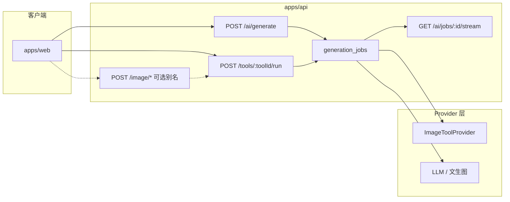

# 椒图对标 — 产品体验借鉴 + 架构优化方案

| 项目 | 内容 |
|------|------|
| 版本 | v1.0 |
| 日期 | 2026-05-26 |
| 结论 | **椒图不是技术/架构上的最优解**；应在 **产品流与运营能力** 上对齐，在 **API 与任务模型** 上以 AIMarket 现有底座做收敛与增强 |
| 关联 | 调研 `docs/research/JIAOTUAI_RESEARCH_REPORT.md` · 接口 `docs/spec/JIAOTU_PARITY_API.md` · 排期 `docs/spec/JIAOTU_PARITY_BACKLOG.md` |

---

## 1. 结论（是否「最优解」）

| 维度 | 椒图做法 | 评价 | AIMarket 建议 |
|------|----------|------|----------------|
| **灵感发现** | 运营预置 `keyword/detail`，点击灌 Prompt/模型/附图 | ✅ 产品成熟、转化高 | **采纳**；内部域模型用 `inspiration_templates`，对外可保留 `/keyword/*` 别名 |
| **主创作** | 独立 `imageChat` SSE | ⚠️ 与工具任务两套协议 | **不复制**；统一 `POST /ai/generate` + 已有 `GET /ai/jobs/:id/stream` |
| **画布工具** | 10+ 独立 `POST /image/*`，命名混乱（`removeBackground`=消除） | ⚠️ 历史包袱、难维护 | **内核统一** `tools/:toolId/run` + `tool_type`；可选 **兼容别名** 转发，不新增 10 条一等公民路由 |
| **任务状态** | `imageTask/taskStatus` | ⚠️ 与主 job 重复 | **单一** `GET /ai/jobs/:jobId`（别名可选） |
| **上传** | COS `token` + `callback` | ✅ 对象存储直传模式正确 | **采纳模式**；实现走已有 `lib/object-storage`，不绑腾讯云字段名 |
| **模型路由** | 多模型 + 积分系数 | ✅ | **已有** `suggestModel` + `estimatePointsBatch`，继续增强 |
| **Prompt 模板** | 长字符串 + `{argument name=...}` | ⚠️ 难校验、难 A/B | **升级为 JSON Schema 变量**；兼容层可渲染为字符串 |
| **多租户** | 偏单用户 | — | **优势**：Workspace / 会话权限 AIMarket 已具备，不必削足适履 |

**一句话**：椒图是 **UX 与运营配置** 的强参考，不是 **API 形态** 的终局；AIMarket 应用「**统一 Job 内核 + 产品别名 + 结构化灵感**」开工。

---

## 2. 建议保留的椒图产品能力（P0 必做）

这些直接决定首页/Studio 体感，与架构无关，应优先落地：

1. **灵感瀑布流**：分页列表 + 详情含 `prompt`、`modelId`、`size`、`qualityLevel`、`imagesList`。
2. **一键灌入工作台**：点击后设置 Prompt、模型、比例、分辨率、参考图（不必跳转 Studio）。
3. **画布 Dock 工具集**：扩图 / 消除 / 抠图 / 局部 / 改字 / 融合 / 超分（裁剪以 **前端 Fabric** 为主）。
4. **积分预估**：生成前可见消耗（已部分实现，需按 `tool_type` 细化）。
5. **润色（魔术棒）**：`POST /prompt/optimize`（先规则/LLM 可切换）。

---

## 3. 建议改进的架构（相对椒图）

### 3.1 统一生成任务模型（核心）

椒图：`imageChat`（SSE）+ `/image/*`（同步/异步混杂）+ `imageTask/taskStatus` 三套。

AIMarket 目标：



**规则**

- 所有出图（主对话、快速、电商、Studio 工具）均写入 **`generation_jobs`**，带 `tool_type`（`null` | `expand` | `erase` | …）。
- **SSE 只保留一条**：`GET /api/v1/ai/jobs/:jobId/stream`（已实现），前端 CreationPanel 默认接此流；**不新增** `imageChat` 除非有强兼容需求。
- `POST /api/v1/image/extendImage` 等：仅在需要对接旧脚本/第三方时作为 **薄别名**，内部 `map → toolId + createGenerationJob`。

### 3.2 灵感域模型（优于 `keyword` 命名）

| 层 | 路径/表名 | 说明 |
|----|-----------|------|
| 内部 | 表 `inspiration_templates` | 字段清晰：`title`, `category`, `prompt_template`, `variables_json`, `model_id`, `aspect_ratio`, `resolution`, `cover_url`, `reference_assets` |
| 对外兼容 | `GET /keyword/page`, `GET /keyword/detail/:id` | 响应形状与椒图一致，由 adapter 映射 |
| 管理 | `POST /admin/inspiration` | 比 `admin/keyword` 可读；可同时写 keyword 别名 |

**Prompt 变量（推荐）**

```json
{
  "template": "一张{{product}}的电商主图，{{style}}风格",
  "variables": [
    { "key": "product", "label": "产品名", "default": "护肤品" },
    { "key": "style", "label": "风格", "default": "极简白底" }
  ]
}
```

前端点击灵感后：先填默认值，用户可改变量再生成；椒图式 `{argument name=...}` 由服务端 **兼容解析** 写入 `variables_json`。

### 3.3 工具注册表（优于 10 个硬编码路由）

扩展 `apps/api/src/lib/tools.ts`：

```typescript
interface ToolDefinition {
  id: string;                    // expand | erase | cutout | ...
  name: string;
  category: "edit" | "enhance" | "compose";
  inputSchema: z.ZodType;        // 每工具参数（mask、region、scale）
  defaultPrompt: string;
  pricingFactor: number;
  providerKey?: string;          // P4 对接
  legacyAliases?: string[];      // e.g. ["extendImage"]
}
```

- `GET /tools/list` 返回完整元数据（Studio Dock 动态渲染）。
- `POST /tools/:toolId/run` 为 **唯一写入口**；校验 `inputSchema` 后 `createGenerationJob`。
- Provider 按 `providerKey` 注入，避免每个 API 文件复制扣费/鉴权逻辑。

### 3.4 上传与资产（模式借鉴，实现统一）

| 椒图 | AIMarket 优化 |
|------|----------------|
| `/upload/token` + `/upload/callback` | `POST /assets/upload-url` + `POST /assets/confirm`（语义更清晰） |
| `ossId` | 统一 `assetId`（UUID），前端只认 asset |
| COS 字段 | `lib/object-storage`（local / S3 / COS 可配置） |

可选：同时注册 `POST /upload/token` → 转发到 `assets/upload-url`，减少前端分支。

### 3.5 前端协议（Next.js 最佳实践）

- **灵感**：Server Component 拉首屏 + 客户端「加载更多」；详情点击走 client mutation 灌入 `CreationPanel` context（避免整页刷新）。
- **生成**：默认 `generate` → `jobs/:id/stream`；轮询仅作降级。
- **画布裁剪**：纯客户端 Fabric，**不调 API**（与椒图一致）。
- **消除 vs 抠图**：UI 与 API 均使用 `erase` / `cutout`，**禁止**沿用 `removeBackground` 语义（仅在兼容别名层映射）。

### 3.6 横切能力（AIMarket 已有、椒图未强调）

- **Workspace 级会话与权限**（`session-access`）：工具/生成必须带 `sessionId`，防止越权。
- **内容审核**（`assertPromptAllowed`）：灵感模板入库也需审核状态 `published | draft`。
- **可观测**：`events` 埋点统一 `inspiration.click`、`tool.run`、`job.complete`。
- **Provider 注册表**：文生图与图像工具共用队列，便于 P4 换真供应商。

---

## 4. 与椒图的兼容策略（按需，非默认）

| 场景 | 策略 |
|------|------|
| 自有 Web 前端 | 只调 canonical API（`generate`、`tools`、`inspiration` 或内部名） |
| 迁移椒图脚本/文档 | 环境变量 `COMPAT_JIAOTU_ALIASES=true` 挂载 `/keyword/*`、`/image/*`、`/upload/*` 转发 |
| 第三方集成 | 在 OpenAPI 文档中标注 **Stable: /ai/generate**；Alias 标 **Deprecated** |

---

## 5. 修订后排期（相对原 BACKLOG）

| 原阶段 | 原内容 | 优化后 | 变化 |
|--------|--------|--------|------|
| P0 | keyword API + 前端 | **inspiration_templates** + `/inspiration/*` + `/keyword/*` 别名 + 变量模板 | +0.5d schema |
| P1 | 复制 upload 路径 | **assets 预签名统一** + `/upload/*` 可选别名；`prompt/optimize` | 路径更名，工作量相当 |
| P2 | 新增 10 条 `/image/*` | **扩展 tools 注册表 + inputSchema**；别名转发 **可选** | **省约 3 人日** |
| P3 | 新建 `imageChat` SSE | **删除**；强化现有 job SSE + 前端默认接入 | **省约 3 人日** |
| P4 | Provider | 按 `ToolDefinition.providerKey` 接入 | 不变 |

**新的优先级**

1. P0 灵感 API（优化 schema）
2. P1 上传 + 润色
3. P2 工具注册表 + Dock（不铺 10 条独立路由）
4. P4 真供应商（与 P2 可部分并行）
5. 兼容别名层（仅在有外部对接需求时做）

---

## 6. 风险与不做清单

**不做（除非用户明确要求）**

- 为对标而 **废弃** `POST /tools/:toolId/run`
- 引入第二套 SSE 协议 `imageChat`（**已实现**：仅 `GET /ai/jobs/:id/stream`；`NEXT_PUBLIC_USE_JOB_STREAM=false` 时前端降级轮询）
- 在核心代码里写死腾讯云 COS 字段名
- 将 `removeBackground` 作为消除功能的 **主名称**

**需产品确认**

- 灵感变量：首页是否展示「可编辑变量表单」还是仅填默认 Prompt（建议 V1 仅默认，V1.1 表单）
- 抠图/超分：V1 是否接受 Mock（排期 P4 前）

---

## 7. 开工检查清单

- [ ] 阅读本文件 + `JIAOTU_PARITY_API.md`（canonical vs alias 章节）
- [ ] P0 分支：`feature/inspiration-api`（表名 `inspiration_templates`）
- [ ] 前端：`InspirationGallery` 改 API；`applyInspiration(detail)` 灌入 CreationPanel
- [ ] 本地：`pnpm typecheck` + `pnpm test:integration`
- [ ] PR 不直推 main；CI 全绿再合并

---

## 8. 参考文献

- 椒图调研：`docs/research/JIAOTUAI_RESEARCH_REPORT.md`
- 现有实现：`apps/api/src/routes/ai.ts`（generate + job stream）、`apps/api/src/routes/tools.ts`
- 技术规格：`docs/TECH_SPEC.md`
