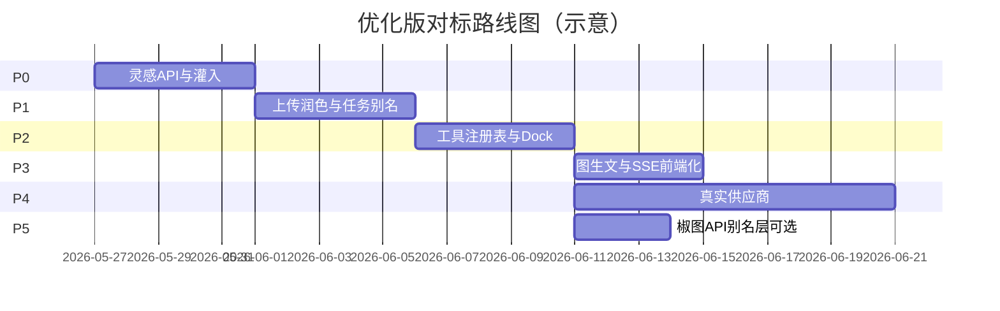

# AIMarket 椒图对标 — 任务排期单（优化版）


| 项目        | 内容                                             |
| --------- | ---------------------------------------------- |
| 版本        | v0.2（架构优化后）                                    |
| 排期基准      | 2026-05-26                                     |
| 架构依据      | `**docs/spec/JIAOTU_OPTIMIZED_DESIGN.md**`（必读） |
| 关联 API 草案 | `docs/spec/JIAOTU_PARITY_API.md`               |
| 关联调研      | `docs/research/JIAOTUAI_RESEARCH_REPORT.md`    |


**说明**：在椒图 **产品流** 上对齐，在 **API** 上采用「统一 Job + Canonical + 可选别名」。每项含分支建议、估时（人日）、依赖、验收标准。

---

## 总览路线图




---

## Phase 0 — 灵感发现闭环（P0，约 5.5 人日）


| ID   | 任务                                                    | 分支建议                      | 估时   | 依赖   | 验收标准                                |
| ---- | ----------------------------------------------------- | ------------------------- | ---- | ---- | ----------------------------------- |
| P0-1 | 表 `inspiration_templates`（含 `variables_json`）+ seed   | `feature/inspiration-api` | 0.5d | —    | 迁移可跑；≥20 条 seed                     |
| P0-2 | `GET /inspiration/page`、`GET /inspiration/:id`        | 同上                        | 1d   | P0-1 | 公开可访问；返回 promptTemplate + variables |
| P0-3 | Adapter：`GET /keyword/page`、`GET /keyword/detail/:id` | 同上                        | 0.5d | P0-2 | 响应形状与调研报告一致                         |
| P0-4 | detail：`reference_assets` 兜底 cover；渲染最终 `prompt` 字段   | 同上                        | 0.5d | P0-2 | 前端可直接用 `prompt` 或模板+变量              |
| P0-5 | 管理 `POST /admin/inspiration`（最小 CRUD）                 | 同上                        | 1d   | P0-1 | 可录入模板/模型/比例                         |
| P0-6 | 前端 `InspirationGallery` API 驱动 + `applyInspiration()` | 同上                        | 1.5d | P0-2 | 点击灌 prompt+模型+比例+分辨率+附图             |
| P0-7 | 集成测试 + E2E「点击灵感」                                      | 同上                        | 0.5d | P0-6 | CI 通过                               |


**P0 里程碑**：灵感从静态 TS 升级为 DB + API；**不必**依赖 10 条 image 路由。

---

## Phase 1 — 上传 / 润色 / 任务查询（P1，约 5 人日）


| ID   | 任务                                                  | 分支建议                      | 估时   | 依赖   | 验收标准                        |
| ---- | --------------------------------------------------- | ------------------------- | ---- | ---- | --------------------------- |
| P1-1 | `POST /assets/upload-url`（object-storage 预签名）       | `feature/assets-presign`  | 1d   | —    | 返回 uploadUrl + assetId 占位   |
| P1-2 | `POST /assets/confirm` 写 assets 表                   | 同上                        | 0.5d | P1-1 | generate 可引用 assetIds       |
| P1-3 | 可选别名 `/upload/token`、`/upload/callback` 转发          | 同上                        | 0.5d | P1-2 | `COMPAT_JIAOTU_ALIASES` 下可用 |
| P1-4 | `POST /prompt/optimize`（规则版，可换 LLM）                 | `feature/prompt-optimize` | 1d   | —    | 魔术棒可用                       |
| P1-5 | `GET /imageTask/taskStatus` → 转发 `GET /ai/jobs/:id` | 同上                        | 0.5d | —    | 状态字段映射一致                    |
| P1-6 | 文档 TECH_SPEC + README                               | 同上                        | 0.5d | —    | Canonical API 列表更新          |
| P1-7 | 前端上传走 presign（feature flag）                         | 同上                        | 1d   | P1-2 | 大文件可走新链路                    |


**P1 里程碑**：资产与润色就绪；仍走统一 Job。

---

## Phase 2 — 工具注册表 + Studio Dock（P2，约 5 人日）


| ID   | 任务                                                      | 分支建议                   | 估时   | 依赖   | 验收标准                        |
| ---- | ------------------------------------------------------- | ---------------------- | ---- | ---- | --------------------------- |
| P2-1 | 扩展 `ToolDefinition`（category、inputSchema、pricingFactor） | `feature/studio-tools` | 1d   | —    | cutout/upscale 等 id 入表      |
| P2-2 | `POST /tools/:toolId/run` 校验 schema + `tool_type` 写 job | 同上                     | 1d   | P2-1 | expand/erase/cutout 可跑 Mock |
| P2-3 | `GET /tools/list` 供 Dock 动态渲染                           | 同上                     | 0.5d | P2-1 | Studio 工具栏与 API 一致          |
| P2-4 | Studio Dock 对接 toolId + job stream                      | 同上                     | 1.5d | P2-2 | 扩图/消除/抠图可点击出图               |
| P2-5 | 裁剪：仅 Fabric 客户端，无 API                                   | 同上                     | 0.5d | —    | 文档注明                        |
| P2-6 | 集成测试 2 个工具 + 积分扣费                                       | 同上                     | 0.5d | P2-4 | CI smoke                    |


**P2 里程碑**：画布工具走 **统一 tools 路由**；不强制铺 10 条 `/image/`*。

---

## Phase 2.5 — 焦点编辑（Focus Edit，约 4 人日）

> 规格见 **`docs/spec/FOCUS_EDIT.md`**（含飞书用法、对象替换、椒图 API 对标）。

| ID    | 任务 | 分支建议 | 估时 | 依赖 | 验收标准 |
| ----- | ---- | -------- | ---- | ---- | -------- |
| FE-1  | 规格文档 `FOCUS_EDIT.md` + backlog 条目 | `docs/focus-edit-spec` | — | P2 | 评审通过 |
| FE-2  | `POST /focus/point` + `focus-mock` + 工具注册 `focus-edit` | `feature/focus-edit` | 1d | P2 | 集成测试识别接口 |
| FE-3  | 画布点选模式 + Chip 列表 + `focus-edit/run`（`intent` edit/replace） | 同上 | 1.5d | FE-2 | 手测改字 + 替换各 1 次 |
| FE-4  | Seedream 生成 + prompt 模板 | 同上 | 1d | P4-4 | staging 真图 |
| FE-5  | 集成测试 + E2E 冒烟 + 快捷键 | 同上 | 0.5d | FE-3 | CI 绿 |

**FE 里程碑**：Studio 完成「点选物体 → 短 prompt（含替换）→ 出新图」闭环。

---

## Phase 3 — 图生文 + SSE 产品化（P3，约 4 人日）


| ID   | 任务                                            | 分支建议                     | 估时   | 依赖   | 验收标准                   |
| ---- | --------------------------------------------- | ------------------------ | ---- | ---- | ---------------------- |
| P3-1 | `POST /image/prompt-reverse`（或 tools 子能力）mock | `feature/prompt-reverse` | 1d   | —    | 上传图返回示例 prompt         |
| P3-2 | 前端 CreationPanel **默认** `jobs/:id/stream`     | 同上                       | 2d   | —    | 生成过程流式状态；轮询为 fallback  |
| P3-3 | 文档：明确 **不实现** `imageChat` 除非兼容开关              | 同上                       | 0.5d | —    | OPTIMIZED_DESIGN 与代码一致 |
| P3-4 | E2E 流式生成 smoke                                | 同上                       | 0.5d | P3-2 | CI 通过                  |


**P3 里程碑**：体验对标椒图「有进度感」，协议保持单一 SSE。

---

## Phase 4 — 真实供应商（P4，约 10+ 人日，可与 P2 并行）


| ID   | 任务                                | 分支建议                      | 估时  | 依赖     | 验收标准             |
| ---- | --------------------------------- | ------------------------- | --- | ------ | ---------------- |
| P4-1 | `ImageToolProvider` 接口 + registry | `feature/providers-tools` | 1d  | P2     | 与文生图 Provider 并列 |
| P4-2 | cutout（matting）                   | 同上                        | 2d  | P4-1   | 透明底 PNG          |
| P4-3 | upscaling / enhance               | 同上                        | 2d  | P4-1   | 2x/4x            |
| P4-4 | expand / partialEdit（inpaint）     | 同上                        | 3d  | P4-1   | 扩图与局部            |
| P4-5 | `prompt/optimize` LLM             | 同上                        | 1d  | P1-4   | 润色质量可感知          |
| P4-6 | 生产密钥与 DEPLOY 文档                   | 同上                        | 1d  | P4-2~5 | 无密钥进库            |


---

## Phase 5 — 椒图 API 别名层（P5，可选，约 3 人日）


| ID   | 任务                                      | 分支建议                     | 估时   | 依赖   | 验收标准                     |
| ---- | --------------------------------------- | ------------------------ | ---- | ---- | ------------------------ |
| P5-1 | `routes/compat/jiaotu.ts` 挂载 `/image/`* | `feature/jiaotu-aliases` | 1.5d | P2   | extendImage → expand 等映射 |
| P5-2 | 集成测试别名转发                                | 同上                       | 1d   | P5-1 | 开关关闭时 404                |
| P5-3 | OpenAPI 标注 Deprecated                   | 同上                       | 0.5d | P5-1 | 文档可区分 Stable/Alias       |


**仅在有外部对接/迁移脚本需求时启动 P5。**

---

## 横切任务（全程）


| ID  | 任务                                         | 说明                               |
| --- | ------------------------------------------ | -------------------------------- |
| X-1 | 每项 PR：typecheck + integration + E2E        | 遵循 `.cursorrules`                |
| X-2 | `docs/PRODUCT.md` 更新灵感/工具说明                | 与研发同步                            |
| X-3 | 埋点：inspiration.click、tool.run、job.complete | 统一事件名                            |
| X-4 | `pricing.ts` 按 `tool_type` 扩展系数            | 与 P2 同步                          |
| X-5 | 灵感 `draft/published` + 审核                  | 入库模板需 `assertPromptAllowed` 同类策略 |


---

## 优先级建议（优化后）

1. **必做**：P0 → P2（灵感 + 工具注册表 + Dock）
2. **应做**：P1（上传 + 润色）
3. **应做**：P3（job SSE 前端默认化）
4. **按需**：P5（椒图别名）
5. **并行**：P4（真供应商）

**已删除/降级（相对 v0.1 排期）**

- ~~P2 铺 10 条独立 `/image/`* 一等路由~~ → 合并为 P2 注册表 + 可选 P5 别名
- ~~P3 新建 `imageChat` SSE~~ → 使用现有 `jobs/:id/stream`

---

## 与已合并 PR 的关系

- 首页固定工作台、比例线框、手机/微信登录（PR #11）— **已完成**
- `POST /tools/:toolId/run` — **保留并增强**，不废弃

---

## 任务认领模板（复制到 Issue）

```markdown
## Summary
[一句话]

## Architecture
- [ ] 走 Canonical API（见 JIAOTU_OPTIMIZED_DESIGN.md）
- [ ] 别名（如有）：COMPAT_JIAOTU_ALIASES

## API / UI
- [ ] 接口：
- [ ] 页面：

## Test plan
- [ ] pnpm typecheck
- [ ] pnpm test:integration
- [ ] E2E（如适用）

## Ref
- docs/spec/JIAOTU_OPTIMIZED_DESIGN.md
- docs/research/JIAOTUAI_RESEARCH_REPORT.md
- docs/spec/JIAOTU_PARITY_API.md
```

