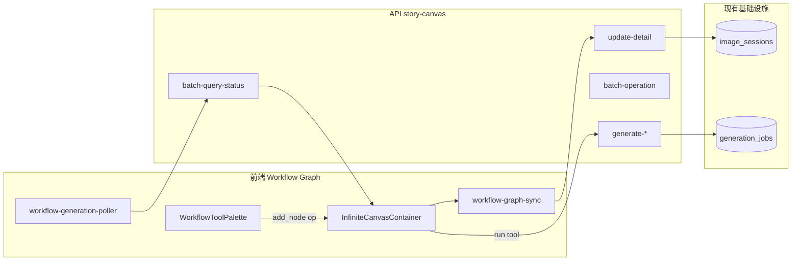
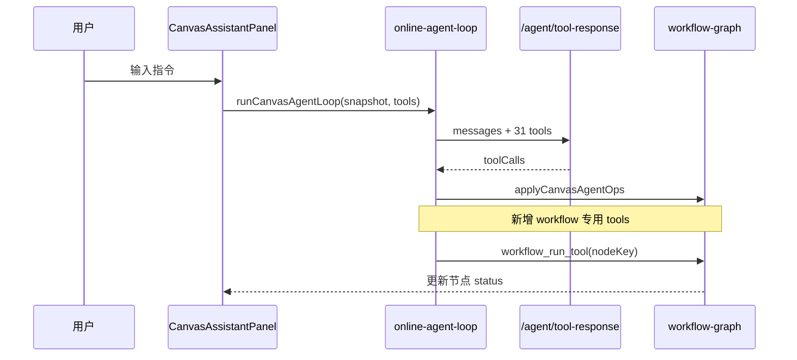

# NeoWOW Workflow 深度复刻 — 技术设计规格

> 目标 URL：`https://neowow.cn/workflow?sessionId=2074796563114016768`  
> 对标对象：NeoWOW `WorkflowCanvas`（story-canvas 体系），非短剧制片 `agent/canvas/*`  
> 状态：草案，待评审

---

## 1. 问题陈述

AIMarket 需要深度复刻 NeoWOW 工作流编辑器的核心体验：

- **左**：无限画布 + 工具节点图（Vue Flow 式 DAG）
- **右**：Agent 对话面板（GeminiChatAgent / Scope 体系）
- **上**：产品壳（列表、模板、文件夹、分享、积分）

当前 AIMarket 已在 `workflowShell` 实现「左画布 + 右 Agent」布局壳层，Phase 1/2a 补齐列表页与工具调色板，但**画布引擎语义**与 **Agent 运行时** 与 NeoWOW 存在结构性差距。

---

## 2. NeoWOW 反编译结论（蒸馏）

### 2.1 技术栈

| 层 | NeoWOW | AIMarket 现状 |
|----|--------|---------------|
| 画布引擎 | **Vue Flow**（节点图 + handle 连线） | CSS transform InfiniteCanvas（自由画布） |
| 3D | PlayCanvas（仅 3D World 节点） | 无 |
| Agent | `GeminiChatAgent` + `/agent/scope/*` | `CanvasAssistantPanel` + `/agent/tool-response` |
| 持久化 API | `/agent/story-canvas/*` | `/api/v1/imageSession/*` + `canvas_layout` |
| 会话模型 | `sessionId` + `nodes[]` + `edges[]` + `nodeKey` | `image_sessions` + `CanvasItem[]` + `infiniteConnections` |

### 2.2 核心 API 域（story-canvas）

```
Session:  create / list(v2/v3) / detail / update / delete / clone / copy / share
Graph:    update-detail / batch-operation / page-nodes
Generate: generate-text / generate-audio / generate-music / upscale-* / outpainting / lighting / pose / world-model ...
Poll:     batch-query-status / latest-generation / list-generations
Template: session/template/{categories,list,detail,use}
Folder:   folder/{create,rename,move,delete}
```

### 2.3 工具节点类型（25+）

高频：`TEXT_TO_IMAGE` `IMAGE_TO_IMAGE` `TEXT_TO_VIDEO` `IMAGE_TO_VIDEO` `IMAGE_OUTPAINTING` `IMAGE_UPSCALE` `LIGHTING_MODIFICATION` `POSE_REFERENCE` `MOTION_CONTROL` `LIP_SYNC` `MUSIC_GENERATION` `AUDIO_GENERATION` `WORLD_MODEL` `SHOT_ASSOCIATION` …

节点数据：`nodeKey`（任务关联键）、`referenceNodeIds`、`connectedImageUrls/VideoUrls/AudioUrls`、`status`（PENDING/PROCESSING/SUCCESS/FAILED）。

### 2.4 Agent 体系（Scope）

```
POST /agent/scope/reply          # 主对话
GET  /agent/scope/models
GET  /agent/scope/conversations
POST /agent/scope/user-skills/*
```

与画布 Agent **并行**：Scope Agent 负责对话/Skill；画布节点各自调 story-canvas 生成 API。

---

## 3. 子系统分解

本项目必须拆为 **三条独立技术轨道**，可并行但接口需预先定义：

```
┌─────────────────────────────────────────────────────────────┐
│  Track A — 产品壳 (Product Shell)                           │
│  /workflows 列表 · 文件夹 · 模板画廊 · 分享 · 访客草稿       │
├─────────────────────────────────────────────────────────────┤
│  Track B — 无限画布 (Workflow Graph Engine)                 │
│  工具节点 · 连线语义 · nodeKey · 生成 API · 状态轮询         │
├─────────────────────────────────────────────────────────────┤
│  Track C — Agent 面板 (Workflow Agent Runtime)              │
│  对话 · 工具确认 · 历史会话 · 流式 · Skill · 画布操控        │
└─────────────────────────────────────────────────────────────┘
         │                    │                    │
         └────────────────────┴────────────────────┘
                    sessionId 统一锚点
```

**依赖关系：**

- Track B、C 均依赖 `sessionId` + 持久化层
- Track C 读/写 Track B 的画布快照（`CanvasAgentSnapshot`）
- Track A 只管理会话元数据，不直接操作节点图

---

## 4. 三种技术路径（方案对比）

### 方案 A — 渐进增强（推荐）

**策略**：保留 AIMarket CSS InfiniteCanvas，在其上叠加「工具节点层」，API 新增 `story-canvas` 路由组镜像 NeoWOW 形状，底层复用 `generation_jobs`。

| 优点 | 缺点 |
|------|------|
| 复用已有 Agent 31 工具、Drama 节点、模板 | 与 Vue Flow 交互细节有差距（handle、snap） |
| 最小迁移风险，可分期交付 | 长期需维护「素材画布」与「工具图」双语义 |
| 符合现有 `workflowShell` 投入 | |

### 方案 B — Vue Flow / React Flow 替换

**策略**：workflow 模式专用 React Flow 引擎，与 Studio Scroll/Infinite 分离。

| 优点 | 缺点 |
|------|------|
| 最接近 NeoWOW 交互 | 第三套画布引擎，体积与维护成本高 |
| handle 连线、节点面板成熟 | 与现有 `CanvasItem` 双向同步复杂 |
| | Agent ops 需重写适配 |

### 方案 C — 后端优先镜像

**策略**：先完整实现 `/api/v1/story-canvas/*`，前端暂用薄壳。

| 优点 | 缺点 |
|------|------|
| API 契约稳定，可多端复用 | 用户无可感知价值直到前端跟上 |
| 利于 MCP/外部 Agent 接入 | 周期长，反馈慢 |

### 推荐：方案 A（渐进增强）

理由：

1. Phase 1/2a 已验证 `workflowShell` + `workflow-tool-registry` 路径可行
2. AIMarket Agent 已有 function calling 循环，优于从零建 Scope
3. `generation_jobs` 可承载 `nodeKey` 异步任务，无需重造队列
4. 方案 B 可作为 Phase 5 可选升级，非 MVP 阻塞项

---

## 5. Track B — 无限画布技术路径

### 5.1 目标架构



### 5.2 数据模型扩展

在 `canvas_layout` 中新增可选字段（向后兼容）：

```typescript
type WorkflowGraphLayout = {
  version: 2;
  items: CanvasItem[];              // 保留：素材节点
  infiniteConnections: CanvasConnection[];
  workflowNodes?: WorkflowNode[];   // 新增：工具节点快照
  workflowEdges?: WorkflowEdge[];
  dramaNodePositions?: Record<string, Position>;
};

type WorkflowNode = {
  id: string;
  nodeKey: string;                  // 后端任务关联（对标 NeoWOW）
  toolType: WorkflowToolId;
  position: { x: number; y: number };
  data: {
    status: "idle" | "pending" | "processing" | "success" | "failed";
    prompt?: string;
    referenceNodeIds?: string[];
    connectedImageUrls?: string[];
    connectedVideoUrls?: string[];
    connectedAudioUrls?: string[];
    outputUrl?: string;
    outputJobId?: string;
  };
};
```

**nodeKey 生成规则**：`{sessionId}:{nodeId}` 或 UUID，写入 `generation_jobs.metadata.nodeKey`。

### 5.3 连线语义（Phase 2b 核心）

当 edge `A → B` 建立时：

1. 解析 A 的输出 URL（`metadata.content` / `outputUrl` / job output）
2. 写入 B 的 `connected*Urls`（按 B 的 `toolType` 决定 image/video/audio）
3. 触发 `batch-operation` 增量同步

实现点：

- `apps/web/src/lib/workflow-graph-sync.ts` — 纯函数：edges + nodes → connected urls
- `use-design-canvas.tsx` — `onConnectionsChange` 钩子调用

### 5.4 生成执行（Phase 2c）

| workflowToolType | API 路由 | 底层 |
|----------------|----------|------|
| TEXT_TO_IMAGE | `POST /story-canvas/generate-image` | `createGenerationJob` mode=image |
| IMAGE_TO_VIDEO | `POST /story-canvas/generate-video` | mode=video |
| IMAGE_OUTPAINTING | `POST /story-canvas/outpainting` | tool expand |
| IMAGE_UPSCALE | `POST /story-canvas/upscale-image` | 新 tool 或 provider |
| … | … | … |

统一响应：`{ taskId, nodeKey, status: "pending" }`

### 5.5 状态轮询（Phase 2d）

```
GET /api/v1/story-canvas/batch-query-status?sessionId=&nodeKeys=
→ { nodeKey: { status, outputUrl, error } }
```

前端 `workflow-generation-poller.ts`：workflow 模式下每 3s 轮询 pending 节点，更新 `metadata.status`。

### 5.6 与现有 InfiniteCanvas 的边界

| 能力 | Studio `/studio` | Workflow `/workflow` |
|------|------------------|----------------------|
| 默认视图 | ScrollCanvas | InfiniteCanvas（强制） |
| 节点类型 | 素材 + Drama | 素材 + **工具节点** |
| 连线 | 手动 + 血缘 | 手动 + **工具输入注入** |
| 左栏 | 会话侧栏 | WorkflowToolPalette |
| 右栏 | 浮动 Agent | Docked Agent |

---

## 6. Track C — Agent 技术路径

### 6.1 NeoWOW vs AIMarket Agent 差距

| 维度 | NeoWOW | AIMarket | 优先级 |
|------|--------|----------|--------|
| 对话入口 | GeminiChatAgent + scope/reply | CanvasAssistantPanel + tool-response | P1 |
| 工具数 | 节点工具 25+（独立 API） | 31 canvas ops | P2 合并 |
| 写操作确认 | Seedance 合规盾牌 | confirmTools | P1 已有 |
| 历史会话 | /agent/chat/sessions | Tab 占位「开发中」 | P2 |
| 流式响应 | stop-response/regenerate | 非流式 | P3 |
| 用户 Skill | scope/user-skills | MCP canvas-server | P4 |
| 快捷指令 | 节点工具栏 | 4 条 quick tags | P1 扩展 |

### 6.2 目标架构



### 6.3 Agent 扩展（workflow 专用工具）

在 `agent-tools.ts` 新增（示例）：

| 工具名 | 作用 |
|--------|------|
| `workflow_add_tool_node` | 按 toolType 创建工具节点 |
| `workflow_connect_nodes` | 连线并触发 connected urls 注入 |
| `workflow_run_node` | 对指定 nodeKey 触发生成 |
| `workflow_query_status` | 批量查询节点生成状态 |
| `workflow_list_tools` | 返回 registry 可用工具 |

**原则**：Agent 不直接调 25 个生成 API，而是通过 `workflow_run_node(nodeKey)` 委托 story-canvas 层。

### 6.4 历史会话（Phase 3a）

数据模型：

```
workflow_agent_conversations (
  id, session_id, user_id, title, created_at
)
workflow_agent_messages (
  id, conversation_id, role, content, tool_calls_json, created_at
)
```

API：

```
GET  /api/v1/workflow-agent/conversations?sessionId=
POST /api/v1/workflow-agent/conversations
GET  /api/v1/workflow-agent/conversations/:id/messages
POST /api/v1/workflow-agent/conversations/:id/messages  # 复用 tool-response
```

### 6.5 流式响应（Phase 3b）

`POST /api/v1/agent/tool-response/stream` — SSE 推送 assistant delta + tool_call 事件。  
前端 `CanvasAssistantPanel` 增量渲染。

---

## 7. Track A — 产品壳（摘要）

| 能力 | 状态 | 阶段 |
|------|------|------|
| `/workflows` 列表 | ✅ Phase 1 | — |
| 左侧导航入口 | ✅ Phase 1 | — |
| 文件夹 v3 混合列表 | ❌ | Phase 3 |
| 模板画廊（圆形模板） | △ TemplateManager | Phase 3 |
| 分享/克隆 shareCode | ❌ | Phase 3 |
| 访客草稿 | △ draft session | Phase 1 增强 |
| 积分/会员 gates | ❌ | Phase 4 |

---

## 8. 非目标（YAGNI）

- PlayCanvas 3D World（Phase 5+）
- 完整 25+ 工具一期全上（按使用率分批）
- 白标多租户（NeoWOW 的 volcengine/xiaomi 等）
- 替换现有 Studio Scroll 链路

---

## 9. 成功标准

### MVP（Phase 2 完成）

- [ ] 用户从 `/workflows` 进入，创建画布，添加 ≥3 种工具节点
- [ ] 连线后下游节点自动获得上游输出 URL
- [ ] 文生图节点可触发 job 并在画布显示 pending → success
- [ ] Agent 可通过对话添加节点并触发生成
- [ ] E2E：`workflow-agent.spec.ts` + `workflows-list.spec.ts` 全绿

### 深度对齐（Phase 3 完成）

- [ ] 模板一键使用（nodes + edges 反序列化）
- [ ] Agent 历史会话可切换
- [ ] 分享链接可克隆工作流

---

## 10. 风险与缓解

| 风险 | 缓解 |
|------|------|
| InfiniteCanvas 无 Vue Flow handle | Phase 2 用连线中点 + 类型检查；Phase 5 评估 React Flow |
| generation_jobs 无 nodeKey | migration 加 metadata 字段 |
| Agent 与生成 API 双轨不一致 | 统一经 story-canvas service 层 |
| 范围膨胀 | 严格按 Phase 交付，每 Phase 独立 PR |

---

## 11. 推荐实施顺序

```
Phase 1  产品壳 MVP          ✅ 进行中
Phase 2b 连线语义 + 同步 API
Phase 2c 生成 API + nodeKey
Phase 2d 状态轮询
Phase 2e Agent workflow 工具扩展
Phase 3  模板/分享/历史
Phase 4  高级工具（唇形/运镜/3D）
```

---

## 12. 待决问题（需产品确认）

1. **深度对齐优先级**：先补齐生成工具矩阵，还是先 Agent 历史/流式？
2. **画布引擎**：是否在 Phase 3 前评估 React Flow 替换？
3. **积分模型**：是否复用现有 credits，还是 NeoWOW 式按工具计价？
